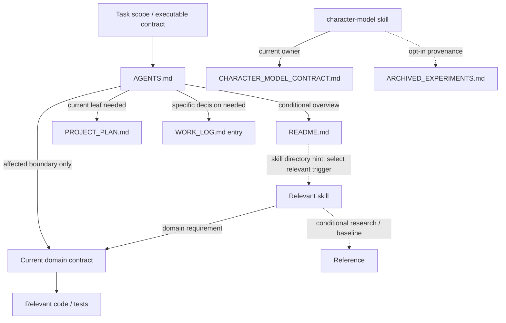

# Documentation Architecture Audit

Final retirement/R3–R8 status is recorded in [the skills audit implementation record](./ASTRA_CONTEXT_AND_SKILLS_AUDIT.md#r3r8-implementation--2026-09-15). The owner took the personal archive; seven verified Markdown originals and two superseded skill roots are removed in the subsequent pass. The implementation/inventory below describes its earlier baseline, including paths that now exist only in Git history or the external archive. It is not a live file index or a prerequisite reading list.

## Implementation record — 2026-09-15

This record describes the subsequent implementation pass from clean `main` at `650507d2458c5a205cd34a6d555f296c56c3c9d9`. The original audit/inventory below remains a dated baseline, not a live index. Baseline checks passed: docs index (98 Markdown / 3 fixture exclusions), encoding and Git diff check. No parallel documentation changes were present.

Implemented:

- Six SPLIT operations retained the active paths for PRODUCT_DASHBOARD, DESKTOP_ADAPTER_PLAN, DESIGN_SYSTEM_CONTRACT, UI_MIGRATION_BASELINES, release-notes and tester-instructions. Dated sections now live under `docs/archive/documentation-2026-09-15/`, listed in the archive registry. Current AppShell/editor interaction details were preserved in the design contract; screenshot names, approved popup/platform rules and system rows remain in the tested active manifest. Desktop adapter APIs, workspace-root safety, presentation transport/privacy and fog fallback remain active.
- Three whole documents moved with `git mv` into `docs/archive/desktop/`: DESKTOP_PRESENTATION_WINDOW_SPIKE, DESKTOP_PROTOTYPE_SMOKE and DESKTOP_TRANSITION_STRATEGY. Historical bodies were preserved. Packaging checks now require current adapter/recovery/policy documents instead of the archived plans. The desktop skill reference is explicitly historical/conditional.
- The seventh proposed split was rejected after local content review: LIGHTWEIGHT_WORKSPACE_OPERATIONS_CONTRACT's NF-001 closure section contains current stale-write/recovery invariants. The file remains unchanged; splitting it merely by its closure heading would move active rules into history.
- `docs/README.md` now maps task areas to owners without a mandatory pre-read. Onboarding delegates workflow to root. Stale Phase 17 tester snapshots and future-tense pinned-position claims were corrected by routing to current owners. Confirmed broad metadata families were narrowed; generated CURRENT-report templates were updated too, so a later report does not recreate broad triggers. Historical research, waivers, assessments and strategy presentation are distinguished from current authority. No new metadata schema was introduced.
- MERGE count is zero: the only audit MERGE_CANDIDATE is design-standards, explicitly deferred by the implementation scope. Anti-slop remains installed. All other skill bodies/descriptions and root AGENTS are unchanged. The audit's broader skill workflow/R3/R4/R5/R6 recommendations are not implemented by this pass.

Current documentation accounting: **163 documents = 124 active/reference/router/skill documents + 3 fixture pages + 29 PROJECT_ARCHIVE + 7 EXPORT_ARCHIVE originals**. Active/reference includes the temporary audit reports; it does not mean mandatory reading. Three complete documents were relocated and six historical extracts added; no export original was removed. The six active split sources decreased from 389,947 to 129,943 UTF-8 bytes (Git text normalized to LF); this is a file-size measurement, not measured model-token savings.

Personal export: `C:/Users/Aruko/Documents/New project/MOW_PERSONAL_ARCHIVE_EXPORT_2026-09-15`. Its seven payload files preserve the repository paths under `repository/`, with `MANIFEST.md`, `SOURCE_COMMIT.txt` and `checksums.sha256`. Source HEAD is `650507d2458c5a205cd34a6d555f296c56c3c9d9`. Payload size: **258,099 bytes**; total including metadata: **265,470 bytes**. Node copied files; an independent PowerShell pass recomputed source/copy/manifest SHA-256, checked sizes and counts (7 payload, 3 support files), and opened both an assessment and the chronicle. All seven matched. The directory is physically outside the Git worktree and is not a symlink or tracked content. The rubric DOCX was not exported.

Second graph pass: 257 local Markdown/HTML hyperlinks checked, zero missing targets; zero stale moved paths in active operational docs/tools/tests/skills; zero mandatory inbound references to the seven export originals. Fourteen remaining exact-path mentions are descriptive inventory/baseline rows in PROJECT_FILE_AUDIT and this audit. Folder policy notes explicitly retain originals pending owner confirmation. Generic prefix classification in the file auditor and optional manual-generator discovery do not require any particular assessment's existence or content; no product/release/task consumer reads them. Historical backlinks remain historical. All six extracted chunks and all moved-document body lines were checked for preservation. Nineteen bidirectional reference pairs remain (for example root/overview, brand/design, contract/contract, tester/scenarios and optional skill/reference); these are selected navigation/ownership links, not an instruction to recursively load their transitive closure.

| Final verification | Result |
| --- | --- |
| `npm run docs:index` | PASS: 104 Markdown, 3 fixture exclusions, no metadata/zone/status-guard failures |
| `npm run check:encoding` | PASS |
| `npm run agents:validate` | PASS: 19 skills |
| `node --test tests/docsStatusGuard.test.mjs tests/uiMigrationBaselines.test.mjs tests/visualRegressionPolicy.test.mjs tests/desktopReleaseGateStatus.test.mjs tests/desktopNativeSmokeStatus.test.mjs tests/desktopLargeWorkspaceSmoke.test.mjs` | PASS: 20 focused tests |
| `npm run desktop:packaging-smoke` | PASS: static configuration/dist/document checks; no browser/native suite or build launched |
| `node ../mow-agent-routing-audit/verify-documentation-restructure.mjs` | PASS: coverage/counts, history preservation, local links, current references, unchanged export originals/skills/root and checksums |
| Independent PowerShell `Get-FileHash -Algorithm SHA256` verification | PASS: 7/7 source/copy/manifest hashes and sizes |
| `git diff --check` / staged diff review | PASS; scoped documentation and four small tooling edits |

The pre-existing optional imported skill reference to unavailable `brand-identity/references/contrast-and-accessibility.md` remains documented in UPSTREAM; it is outside move-related skill reference edits and is not one of the checked Markdown hyperlinks. Broader skill workflow tuning remains a separate stage.

No full browser/native/release suite, DOCX regeneration, dependency update, fetch or push. Export files remain byte-identical and tracked. **EXPORT_ARCHIVE СОЗДАН. ОРИГИНАЛЫ ИЗ GIT НЕ УДАЛЕНЫ.** Removal requires a separate owner confirmation that the external archive was taken/copied and is readable.

## Original audit baseline

Дата: 2026-09-15. Baseline: `d13cfa5e0a7c23238b49d7aa78cb4895f3c57556`, branch `main`, исходный working tree clean. Tracking ref: `refs/remotes/origin/main` → `62483ac511da4e02267d013e1fd8f2a3d6262711`, без fetch. Снимок inventory ниже — после R1/R2, до добавления этого отчёта; сам отчёт учитывается отдельно. Commit/date в inventory означают последнее изменение файла в baseline Git, а не дату проверки его актуальности.

Это временный audit/implementation artifact, **не новый источник продуктовых требований** и не default pre-read. После исполнения принятых follow-up решений оставить краткий closure record и пересмотреть необходимость полного inventory. Никаких migrations/deletions этот отчёт сам по себе не разрешает.

## 1. Executive summary

Подтверждены и исправлены только R1/R2 из [предыдущего аудита](./ASTRA_CONTEXT_AND_SKILLS_AUDIT.md): семь root pointers, Character canonical route и обязательные очереди предварительного чтения в README/onboarding/UI contract и девяти native skills. `AGENTS.md` уменьшился с 5 549 до 5 521 байта. Skill metadata, activation descriptions, post-work obligations, verification/release gates, runner, task schema и production code не менялись.

Существующее деление docs на зоны удачное. Основной оставшийся риск — смешение current contract, текущего статуса и истории внутри отдельных документов, одинаковые metadata triggers и дубли правил между root/skills/onboarding. Новая папочная структура сама по себе этого не исправит. `docs/README.md` уже маленький router; сохранять его и в будущем добавлять только точные owner routes.

Inventory охватывает **156 исходных документов: 153 Markdown, 2 DOCX и 1 HTML-презентацию**. Три Markdown fixture pages учтены как данные примера, не инструкции. `index.html` и `presentation.html` исключены: это runtime entry points. Игнорируемые build/dependency/legacy directories не являются tracked documentation surface. Полный список и категории — в приложениях; новый отчёт — 157-й документ (154-й Markdown).

Кандидаты личного экспорта: **7 Markdown, 258 099 bytes, 21 039 whitespace words**. Это отдельный будущий export task с проверкой сохранённой копии и references; сейчас ничего не удалено. Один MERGE_CANDIDATE и один REMOVE_CANDIDATE остаются рекомендациями R5/R6, без реализации.

Подтверждены 10 групп смыслового overlap и 6 групп authority conflicts ниже; группы пересекаются, их нельзя складывать как независимые bugs. В baseline было 7 отсутствующих root targets и 1 неверный Character authority route — исправлены. После P0 остаются 1 недоступная cross-skill reference и 4 устаревших утверждения current state. Среди 173 найденных локальных Markdown hyperlink occurrences отсутствующих file targets не обнаружено; это отдельная метрика, не утверждение об исправности всех ссылок и всех исторических path mentions.

Рекомендации OpenAI применены через уже проверенный baseline-аудит: precise activation, progressive disclosure, bounded pre-read. [Исходная статья](https://developers.openai.com/blog/rethinking-skills-and-prompts-for-gpt-6-astra) повторно по сети не загружалась. Уменьшение реального token usage/latency **не измерялось**. Этот task не повторял global skill scan: исторические omitted/traversal observations из baseline не выдаются за новое измерение.

## 2. Inventory method and documentation zones

Использован `git ls-files -z`, затем UTF-8 programmatic scan: NUL-delimited paths сохраняют имена с кириллицей и пробелами. Обычный построчный Git output с quoted Unicode давал бы неполный список. Собраны bytes, lines, whitespace words, frontmatter, headings, исходящие ссылки/path mentions, обратные mentions, категории источников и `git log -1 --format='%cs %h' -- <path>`. Не выполнялось чтение всей документации в модель.

Markdown words — whitespace-separated chunks, не tokenizer tokens; HTML words считаются по исходному тексту. DOCX lines/words неизвестны: body manual не извлекался и не регенерировался. Поэтому суммы слов не включают DOCX. HTML-презентация self-contained, внешних `href/src` не найдено. Близкие названия сопоставлялись с реальным назначением: три разных smoke manuals, два knowledge graph документа, несколько release outputs не признаны дублями только по названию.

| Zone | Существующая ответственность | Решение |
| --- | --- | --- |
| Root / assets | Общие инструкции, обзор, provenance icons | Root остаётся глобальным; icon README локальный |
| `.agents/skills/` | 19 skills, 22 references, 1 UPSTREAM | Не новый docs entry point; activation → relevant body → optional reference |
| `docs/00-product/` | Vision, product direction, brand | Не current runtime contract и не журнал ежедневных изменений |
| `docs/01-delivery/` | Roadmap, backlog, release process, evidence | Разделять status owners и исторические/generated outputs |
| `docs/02-architecture/` | Domain/storage/UI contracts, deferred plans, audit evidence | Contract по границе; research/audit только по задаче |
| `docs/03-testing/` | Automated/manual verification references и disposable fixture | Не default pre-read для любого edit |
| `docs/04-user-release/`, `release/latest/` | Установка, tester routes, release-specific acceptance/evidence | Stable instructions отдельно от истории конкретных handoffs |
| `docs/archive/` | Superseded plans и rationale | Уже есть registry/successor routes; сохранить |
| `Тех. зрелость/`, `Лог особенный/` | Explicit historical root exceptions | Кандидаты личного экспорта; не перемещать сейчас |
| DOCX / strategy HTML | Generated manual, rubric, old presentation | Reference/history; не текущая authority |

Metadata не обязательна для root, skill references, release/latest и tests/browser README. Не добавлять туда docs frontmatter автоматически. Новых nested `AGENTS.md` в этом slice нет; doc routing не требует их размножения.

## 3. Canonical owner matrix and code/test evidence

`confirmed` ниже означает подтверждённую **границу владения**, не полную сертификацию каждой строки contract. Существование test не означает его запуск в этом task. Для normative owners сверены actual modules, public boundaries и ближайшие tests; planned-only scope отделён от реализованного поведения. Полная таблица owner/evidence приведена в приложении B.

- Root owns project-wide editing/safety/context rules. Task-specific `.agent-task.json` owns executable scope/verification; schema/runner remain authoritative for actual execution. Runner prompt в `tools/agent_task_runner.mjs:2198` уже требует root routing и запрещает preload manual по умолчанию — менять его незачем.
- `PROJECT_PLAN.md` owns **active implementation roadmap**. BUG_INVENTORY owns stabilization findings, BUGS_AND_IMPROVEMENTS_BACKLOG owns deferred noticed issues; один план не становится owner всех видов tech debt. MOW_AI_CORE_PLAN owns принятую deferred AI scope, не существующие AI runtime capabilities.
- Character / Properties / DnD calculations / Rule Tree имеют разные boundaries: aggregation, source properties, formula rules, reusable rules. Не сливать в «всё о персонаже».
- Backup/recovery / workspace operations / schema / asset lifecycle не взаимозаменяемы: recovery safety, mutation hot path, persistent compatibility, asset identity имеют отдельных owners.
- Combat Action Pipeline — current **architecture-only** contract: существующие Character/Dice/CombatSession/Event modules подтверждают зависимости, но attack implementation отсутствует по принятому Phase 17 scope. Не выдавать contract за готовую feature.
- `DESKTOP_RELEASE_POLICY.md` + release gate code own build/handoff requirements. CURRENT reports — результаты предыдущего выполнения, а не разрешение нового release.

## 4. Semantic duplicate / overlap findings

| ID | Документы / evidence | Owner и уникальная информация | Следующее действие |
| --- | --- | --- | --- |
| D1 confirmed | AGENTS, README §AI Workflow, AI_ONBOARDING, native skill pre-read sections | Root: глобальные правила. Onboarding: карта app/editor/storage связей. Skills: domain checks | R1/R2 выполнены; не переносить весь onboarding в root. R7 clauses отдельно |
| D2 confirmed | design-standards skill, design-system skill, DESIGN_SYSTEM_CONTRACT, BRANDBOOK | Contract owns tokens/primitives; brandbook owns visual intent. Generic skill уникален contrast table, hierarchy, touch/spacing checklist, optional Tailwind mapping | MERGE_CANDIDATE только design-standards root: сохранить применимые contrast/hierarchy checks и ссылки на 3 references в targeted design workflow; не импортировать generic web styling в MOW. R5 не выполнен |
| D3 confirmed | anti-slop, minimal-change, AGENTS, DEFINITION_OF_DONE | Root owns scope/data preservation; DoD owns readiness/unfinished work/regression/overclaim. Anti-slop добавляет примеры плохих claims и общий pass, но отдельной domain authority нет | REMOVE_CANDIDATE anti-slop после замены inbound references на root/DoD/domain review. Сохранить closure/regression obligations. R6 не выполнен |
| D4 confirmed | PROJECT_PLAN, PRODUCT_DASHBOARD, WORK_LOG | План: current leaf. Dashboard: product overview. Log: датированные решения. Уникальны historical waivers/verification context | SPLIT dashboard по ролям: оставить overview/current pointer, исторические entries переносить только после проверки log; не копировать весь журнал |
| D5 confirmed | DESKTOP_ADAPTER_PLAN, PRESENTATION_WINDOW_SPIKE, TRANSITION_STRATEGY | Adapter APIs и presentation privacy/transport сохраняются в current adapter documentation; spike хранит причину отказа от cross-window DOM clone | SPLIT adapter current boundaries vs completed steps; spike/transition → PROJECT_ARCHIVE с successor, без потери rationale |
| D6 confirmed | RELEASE_PROCESS, DESKTOP_RELEASE_POLICY, packaging/backup smoke, README_FOR_TESTERS, release/latest | Release process: version/rollback. Policy: build gate. Procedures: exact manual steps. Latest: build-specific evidence | Сохранять authority boundaries; SPLIT только длинные latest files на current handoff и dated history. Gate paths сохранять |
| D7 confirmed | SMOKE_TESTS, MANUAL_SMOKE_CHECKLIST, TEST_SCENARIOS, tests/browser/README | Разные audiences: developer command routing, human core flows, tester acceptance, browser harness. Уникальны paste/schema recovery, workspace safety, filter usage | KEEP_REFERENCE; overlap не основание слияния всех checks. По будущей задаче ссылаться на нужный scenario вместо копирования |
| D8 confirmed | UI_CSS_INVENTORY_REPORT, UI_MIGRATION_BASELINES, DESIGN_SYSTEM_CONTRACT | Inventory: dated surface snapshot. Baselines: approved screenshot evidence/attachment contract. Design: current semantic tokens/behavior | SPLIT baselines: active visual QA rules и historical migration inventories; split design contract: invariant core и migration history. Снимки не объявлять актуальными counts без повторного scan |
| D9 confirmed | KNOWLEDGE_GRAPH_MODEL, KNOWLEDGE_GRAPH_ENTITY_CONTRACT | Model owns graph derivation/view-state mechanics, entity contract owns page UX/persistent shell. Уникальны typed relationship inputs, inspector scope, pinned-position mechanics | Сохранить оба с точным взаимным routing; исправить stale «когда появятся pinned positions» отдельно (A5) |
| D10 confirmed | Generic a11y/performance/PM/QA skills и references | 4 exact paragraph groups ≥140 chars: shared evidence-gap text в 4 skills; visually-hidden CSS в 2 references; historical heavy asset list; maturity scale | Небольшие повторы intentional/self-contained; не centralize ради строк. Framework-specific refs остаются optional. R3/R4 не выполнены |

**MERGE second pass:** у единственного MERGE_CANDIDATE, design-standards, есть уникальные contrast ratios, hierarchy guidance, spacing/mobile rules, component consistency checklist, preship checklist и Tailwind reference. До удаления root body сохранить применимые clauses в domain workflow/reference и заменить ссылки из generic review/a11y refs; не считать весь файл полностью продублированным. Mobile/web-specific советы не становятся требованиями desktop MOW без соответствующей задачи. Все три reference-файла отдельно KEEP_REFERENCE. Два knowledge graph документа и smoke manuals после проверки уникального содержания оставлены раздельно.

## 5. Authority conflicts

| ID | Подтверждение | Owner / решение | Состояние |
| --- | --- | --- | --- |
| A1 confirmed | Root targeted context vs blanket pre-read в README/onboarding/9 skills/UI source list и migration gates | Root + affected contract; historical decision only on demand | R1 исправлен |
| A2 confirmed | Character skill вел к archived experiments без current Character contract | CHARACTER_MODEL_CONTRACT; archive opt-in только для происхождения решения | R2 исправлен |
| A3 confirmed | AI_ONBOARDING §Обязательные Проверки Перед Изменениями требует verify до edit и README/plan/log/DOCX связку; root запрещает blanket policy | Root workflow; release gates/task-required checks сохраняются | R7, **не менялся**. Нельзя заявлять, что все instruction conflicts устранены |
| A4 confirmed | TEST_SCENARIOS:29 говорит Phase 17 NEXT/not started; KNOWN_ISSUES:12 — NEXT/not ACTIVE. PROJECT_PLAN current state и dashboard: Phase 17 ACTIVE, 17.1 done, 17.2 next | PROJECT_PLAN current leaf; tester docs сохраняют Phase 16 acceptance, заменяют только чужой current roadmap snapshot на route | Не исправлялось вне R1/R2; docs:index PASS этого расхождения не доказывает/не ловит |
| A5 confirmed | KNOWLEDGE_GRAPH_ENTITY_CONTRACT:40,142 говорит о будущих pinned positions; MODEL:82 и knowledgeGraphViewState + tests уже описывают saved pins | Current model/view-state code; entity UX contract остаётся owner shell/interaction | Уточнить temporal wording; не менять runtime/persistence из-за старого предложения |
| A6 confirmed | PRESENTATION_WINDOW_SPIKE §Текущий статус описывает DOM clone, §следующий шаг ещё планирует presentationEntry/BroadcastChannel | `js/presentation/presentationEntry.js` и presentation browser tests уже используют BroadcastChannel | PROJECT_ARCHIVE spike с current adapter/transport route; rationale оставить |

Временные «current» headers в release/latest и dated CURRENT reports — дополнительный риск выбора неправильной даты, но не автоматически доказанная ложь всех старых записей. Архивные планы **уже** помечены superseded; отсутствие новой metadata role само по себе не делает их текущими owners.

## 6. Broken/stale routes: проверенные границы

| Route | Результат / replacement |
| --- | --- |
| 7 root pointers из R2 | Все новые paths существуют: contracts/BLOCK_SYSTEM, SAFE_HTML, PAGE_REPOSITORY, ASSET_LIFECYCLE; architecture/CAMPAIGN_MAP_PERFORMANCE_STRATEGY; delivery/PROJECT_PLAN, WORK_LOG. Старый PLANS_AND_TECH_DEBT не заменён universal tech-debt owner |
| Character → archived experiment as current owner | Заменён canonical Character route; существующий archive сохранён как conditional historical reference |
| design-standards §WCAG → `brand-identity/references/contrast-and-accessibility.md` | Файл отсутствует, **confirmed unavailable reference**, уже честно указан в UPSTREAM:48 как not installed. В будущем route к local design contract + existing accessibility-audit/wcag reference; специфический внешний contrast tool этим не появляется |
| A4/A5/A6 | 4 stale current-state sites: TEST_SCENARIOS, KNOWN_ISSUES, graph entity, presentation spike. Owners/replacements выше существуют, изменения отложены |

Программный extractor нашёл 400 unresolved **inline path mentions**, но это не 400 сломанных навигационных ссылок. Среди них old paths в WORK_LOG/archive/maturity, примеры task output filenames, команды с `.docx` внутри, disposable workspace pages и bare basenames с известным owner. Например Tailwind reference содержит корректную ссылку `../SKILL.md`: отдельный match inline label `SKILL.md` был false positive. Два fragments `PROJECT_PLAN.md#deferred-ai-block` соответствуют heading `## Deferred AI Block` (GitHub Markdown slug). 173 local Markdown hyperlinks проверены на **relative** targets без fallback к root; 0 отсутствующих. Remote URLs не проверялись сетью, arbitrary generated links и image assets этой цифрой не сертифицируются.

`MOW_AI_Core_implementation_plan.docx` — внешний owner input с SHA-256 в MOW_AI_CORE_PLAN:19, а не пропавший tracked contract. Current deferred scope уже перенесён в этот план. Не требовать исходный DOCX для routine implementation и не записывать его отсутствие как broken repo hyperlink. Старые `docs/Новые идеи к адаптации.txt` в maturity assessments — historical input, не current requirement.

## 7. Реальный routing graph

Скан links + code-formatted paths дал 647 различных document→document edges и 50 пар взаимных ссылок. Это **лексический graph**, включающий historical citations и write targets; не execution trace. Ни ссылка, ни frontmatter сами не доказывают автоматическую загрузку файла моделью.



Это направляющая схема из конкретных разделов root/README/skills; она не утверждает, что root физически включает skill files. Полная adjacency table в приложении C позволяет восстановить исходящие и обратные связи snapshot без повторного чтения body.

| Edge class | Реальные примеры | Смысл |
| --- | --- | --- |
| Mandatory-looking | `Read Before Work` native skill → domain contract; release policy → gate; retained R7 onboarding → verify/manual update | После выбора действительно релевантного skill/процесса; R7 blanket conflict остаётся |
| Conditional | Root → code owner; Character → archive; UI → research/baselines; plan/log specific leaf/decision | R1/R2 внесли эти условия |
| Ordinary hyperlink / locator | README overview, plan archive registry, inventory path table | Не читать всё по ссылкам |
| Archive edge | Plan → superseded snapshots; WORK_LOG → old paths; spike → former implementation | История, не новые инструкции |
| Write/evidence edge | Skill → WORK_LOG в What To Update; release gate → CURRENT report | Не pre-read dependency; не смешивать с read cost |

Fan-out по distinct existing document targets: PROJECT_FILE_AUDIT 151, WORK_LOG 89, previous Astra audit 23, PROJECT_PLAN 21, chronicle 17, archive registry 15. Research file имеет 90 raw link/path occurrences, большинство внешние; нельзя записать их как 90 обязательных repository reads.

Взаимные пары root↔README, brandbook↔design contract, design contract↔inventory/research, skill↔framework reference, plan↔archive и plan↔log требуют остановки traversal по цели задачи. Особенно дорогая прежняя цепочка root/README→dashboard→plan→log охватывала 1 210 702 bytes /139 246 words лишь в трёх документах. R1 убирает её обязательность, но не запрещает нужное исследование. Previous audit и этот audit — сами fan-out nodes; их read_when ограничен follow-up review, они не добавлены в root prereads.

## 8. Metadata audit

`docs:index` проверяет 97 baseline Markdown под docs, пропускает 3 fixture pages, требует summary/read_when/owner_zone и корректную зону; также вызывает narrow status guard. Он не проверяет смысл triggers, Markdown links, полноту supersession или runtime truth.

Подтверждены **23** документа с одинаковым `Before changing the related subsystem`, **6** с `Before verification`; точные списки видны в metadata inventory. WORK_LOG, CHANGELOG, RELEASE_PROCESS и PROJECT_PLAN имеют одинаковые triggers выбора задачи/status, хотя только план owns current leaf. Generic `architecture document for NAME.md` summaries не объясняют boundary. UI research metadata всё ещё включает практически все UI migration surfaces, хотя body routing после R1 task-specific. CURRENT smoke reports не различают в trigger чтение прошлой evidence и проведение нового gate.

Минимальное будущее изменение: сохранить 3 существующих поля, дать summary = роль + boundary, read_when = конкретный trigger/decision, owner_zone = существующая зона. Historical/deferred status сначала выражать в summary и заголовке, не создавать taxonomy service. `parseMetadata` принимает неизвестные scalar keys: `lifecycle: temporary-audit` в этом файле не ломает index, но **не валидируется семантически и не управляет discovery**. Поля authority/role не добавлялись в остальные документы. R8 не реализован.

## 9. PROJECT_ARCHIVE: почему оставить проекту

Полный перечень задаёт classification table. Особо важные случаи:

- Superseded roadmap/milestone/NF backlog/UI plan snapshots: current plan/registry явно связывают их с переходом на master roadmap (`11c0ce2`, 2026-08-10; `git log --follow` проверен для NF backlog). Сохраняют старые acceptance splits и waiver rationale. Не export по одному слову superseded.
- WORK_LOG — ongoing historical decision record, а не current task selector. Классификация PROJECT_ARCHIVE означает роль, не предложение немедленно переместить этот постоянно пополняемый path.
- Owner design findings и Visual Critic: current plan сохраняет **waiver**, а не утверждает, что все visual findings исправлены. Удаление evidence потеряло бы смысл принятого решения.
- Dated smoke records и INNER_HTML_AUDIT: воспроизводимый test сейчас не заменяет то, что реально было проверено на конкретном workspace/date. Сохранять project evidence, убрать широкие triggers позже.
- Desktop presentation/prototype/transition history: staged migration rationale сохраняется; current adapter rules должны остаться доступны до любого move.
- Strategy HTML: старые «сделать прямо сейчас» про map model/smoke/security уже не current roadmap. PROJECT_ARCHIVE, **probable**: semantic preservation check всех слайдов перед возможным личным экспортом ещё нужен.
- Maturity rubric DOCX: PROJECT_ARCHIVE, **needs-owner-decision** относительно будущего личного архива. Не объявлен экспортом: body не анализировался, уникальная методика ещё нужна для чтения оценок.

Текущие CURRENT reports, manual DOCX и file audit **не** REMOVE/EXPORT: code пишет/проверяет report paths, manual имеет специальный generator и handoff history, file audit используется cleanup/status tooling. Generated ≠ disposable автоматически.

## 10. EXPORT_ARCHIVE: индивидуальная проверка

Для всех семи документов classification **confirmed historical/personal, export eligible после prerequisites**. Проверены `git grep -n -F <full path>` и basename, затем folder stems и tooling/release/skill references. Нет content-specific runtime/test/release/skill consumer. `audit_project_files.mjs` содержит generic prefix classification для historical folders; `generate_manual_docx.py` рекурсивно включает подходящие tracked/local text sources. Это discovery/inventory dependencies, не обязательность конкретного assessment. При будущем экспорте обновить актуальную inventory/route, не запускать manual generator автоматически.

`docs/README.md`, LEGACY_LOCAL_HUB, REPOSITORY_CLEANUP_BACKLOG RCB-015 и audit coverage содержат **folder-level** ссылки/placement policy. Commit `5e3efec` явно закрепил хранение root history, поэтому без отдельной export задачи нельзя отменять это placement. Текущая задача разрешает рекомендацию, не удаление.

| Source | Причина / уникальная ценность | Current owner/successor | Inbound refs | Prerequisite перед удалением |
| --- | --- | --- | --- | --- |
| `Лог особенный/Летопись королевства My own world.md` | Авторская нарративная история и последовательность глав; не нормативный contract | WORK_LOG для технических dated decisions; PROJECT_PLAN для current work | PROJECT_FILE_AUDIT; WORK_LOG:14477; maturity 02.06 и 04.06; self-reference | Export с исходным именем/hash, сохранить главы и список источников; inventory/folder routes → export manifest. Историческую запись о создании/ремонте текста не переписывать как current instruction |
| `Тех. зрелость/01.06.2026 - оценка после пункта 6.md` | Score 4.1/5 и evidence после Properties; предложения desktop spike уже исторические | Properties/Character contracts; DESKTOP_ADAPTER_PLAN current boundary | PROJECT_FILE_AUDIT | Сохранить scores, date, tested scope, rubric reference; заменить inventory route |
| `Тех. зрелость/01.06.2026 - оценка.md` | Score 3.8/5, risks до schema/recovery/desktop maturity | Schema/Backup/Asset contracts и relevant backlog | PROJECT_FILE_AUDIT; archive/PLANS_AND_TECH_DEBT | Export evidence и rubric reference; registry/manifest resolution для архивного backlink |
| `Тех. зрелость/02.06.2026 - оценка после desktop image parity.md` | Score 4.15/5, шаги presentation transport/privacy и прежняя verification snapshot | Current presentation code, desktop policy/adapter, tests | PROJECT_FILE_AUDIT | Сохранить ограничения старого prototype, даты и test claims как historical; не переносить старое «NEXT» в план |
| `Тех. зрелость/04.06.2026 - оценка после закрытия Desktop Foundation.md` | Score 4.35/5, evidence закрытия Desktop и перехода к Character | Character contract; desktop release policy; current plan | PROJECT_FILE_AUDIT; WORK_LOG; chronicle | Export test evidence и maturity context, сохранить reciprocal links через manifest; не объявлять старые build PASS текущими |
| `Тех. зрелость/25.05.2026 - оценка.md` | Полная оценочная шкала, ответы/приоритеты до поздних boundaries | Current domain contracts, PROJECT_PLAN, issue backlogs | PROJECT_FILE_AUDIT | Сохранить scores и внешние source references, включая недоступный старый ideas input; сохранить rubric связь |
| `Тех. зрелость/26.05.2026 - оценка.md` | Следующий assessment snapshot и evidence base; повтор шкалы не делает оценки мусором | Current contracts/plan/backlogs | PROJECT_FILE_AUDIT | Export whole dated assessment, не deduplicate исторические scores; inventory/folder routing update |

Уникальных **ныне нормативных** требований в просмотренных assessment conclusions/evidence sections не установлено: schema/recovery, local-first ownership, safe HTML, adapter, Character/model-first, presentation privacy и release evidence уже имеют текущих owners. Личные scores/повествование не надо копировать в contracts. Экспорт должен сохранить **полные оригиналы**, source SHA, UTF-8 имена и rubric linkage вне Git; selective excerpts недостаточны. До удаления ещё раз сверить полный body на новые/неперенесённые current facts и changed refs относительно этого baseline; любой найденный действующий invariant сначала переносится к соответствующему owner, затем повторяется аудит кандидата. Это обязательное ограничение будущего export, не утверждение, что здесь проверен полный manual/rubric.

## 11. REMOVE_CANDIDATE

Единственный кандидат — `.agents/skills/anti-slop/SKILL.md` (recommendation R6). Это удаление дублирующего workflow body, не отказ от evidence/safety. `git grep` по exact path и `anti-slop` выявил references в generic code-review/design-standards и framework/a11y references, старом аудите, file audit и log. Их нельзя оставить ведущими к исчезнувшему skill. Exact name не обязателен для task schema/runner; generic SKILL.md discovery/validation не является hardcoded зависимостью от anti-slop.

Prerequisites: conditional DoD closure route, root scope/data-preservation rules, domain verification intact; каждую active skill reference заменить подходящим owner; historical citations сохранять как history; `agents:validate`, task/verification infrastructure checks выполнить в том будущем slice. Ничего не удалено сейчас. Других fully reproducible/no-value artifacts с достаточным доказательством удаления не установлено.

## 12. Target structure and operations

Сохранить существующие зоны. Не создавать новую глобальную metadata/authority систему или десятки nested AGENTS. Для core contract можно оставить прежний path и выделить историческую часть ссылкой, чтобы code/test/tool references не ломались.

```text
AGENTS.md                         global workflow / safety
README.md → docs/README.md         overview / zone router
.agents/skills/<relevant>/         task workflow → optional references
docs/00-product/                   product intent / brand
docs/01-delivery/                  current roadmap, issues, release process
docs/02-architecture/contracts/    canonical boundaries
docs/02-architecture/{ui,desktop}/ boundary owners + targeted references
docs/03-testing/                   selected verification / fixtures
docs/04-user-release/              stable user/tester routes
release/latest/                    current handoff; stable tool paths
docs/archive/                      project rationale / superseded plans
personal archive outside repo     only after verified export task
```

| Operation | Scope / prerequisite |
| --- | --- |
| KEEP | Canonical/reference owners, 19 installed skills пока follow-up не принят, fixtures, current gate paths |
| MOVE | Только после split: completed desktop spike/prototype/transition history в archive; update inbound router/skills, сохранить rationale |
| MERGE | design-standards body → targeted design workflow/reference, unique contrast/hierarchy/checklists сначала |
| SPLIT | Dashboard current vs chronology; adapter APIs vs migration steps; design invariants vs migration history; UI baseline rules vs inventories; workspace hot-path safety vs completion evidence; latest handoff vs history |
| PROJECT_ARCHIVE | Superseded plans/waivers/smoke/security/history остаются проекту, triggers historical-only |
| EXPORT_ARCHIVE | Семь индивидуально перечисленных Markdown; verified external archive + manifest + routes перед Git removal |
| REMOVE | Anti-slop только после сохранения guarantees и retarget active skill refs; не применять как часть этого task |

## 13. Dependency-safe order

1. Этот slice: R2 paths + R1 targeted pre-reads, then documentation/skill checks и review diff.
2. Отдельный small follow-up исправляет A4/A5/A6 current-state wording; R7/R8 принимаются отдельным scope. Отсутствие model feature не устранять product implementation ради docs.
3. Зафиксировать owner routes в существующем docs router; не копировать contracts туда. При split сначала создать/проверить receiver и перенести уникальные действующие clauses.
4. Retarget consumers: skills, current routers, tool hardcoded output/input paths, tests и release preflight. Tool-owned report paths и CLI commands сохранить либо менять вместе с tests.
5. Сохранить seven-doc export externally, проверить hashes/UTF-8/openability/manifest; обновить active folder/inventory pointers. Существующие исторические assertions не переписывать. Затем отдельно удалить согласованный export set из Git.
6. MERGE/REMOVE skills только после preservation matrix/consumer updates; повторить appropriate checks. Проверить реальное поведение reading на следующих tasks, не выводить token savings из размеров файлов.
7. Завершить этот temporary audit closure record; не добавлять его в постоянный onboarding.

## 14. Second verification pass, risks and unchanged scope

Второй проход был отдельной перепроверкой evidence тем же агентом, **не независимым subagent review**. Повторены exact Git grep export/remove candidates, prefix references, comparison уникальных design-standards clauses, owner/module/test matching, strict relative hyperlink resolution и replacements. Выборочная history: `5e3efec` historical placement, `11c0ce2` master-plan supersession; per-file last edit в inventory. Исправления первой гипотезы: HTML strategy включён в surface; runtime presentation исключён; generic SKILL.md mentions не названы hardcoded anti-slop consumers; Tailwind link label false positive исключён; rubric и generated/manual/current reports не признаны безопасным export/delete.

Риски: references могут строиться динамически (prefix scanning уже учтён); код и docs способны разойтись после snapshot; metadata validity не доказывает content accuracy; старое «current» не свидетельствует о текущем PASS; programmatic counts не доказывают model-visible context budget. Внешние URLs и новая Codex skill discovery сессия не проверялись. Полное снижение omitted/traversal problems этим diff не доказано.

Сознательно не менялись: R3–R8, skill descriptions/activation, global/user config и skills, repo config, runner/contracts/task JSON/worktrees, verification implementation, CI, product runtime, dependency versions, history, DOCX, release files, document placement. Не запускались browser/native/release suites. Fetch/push не выполнялись. Ничего не удалено из Git.

## 15. Реальные owner decisions

- Где хранить личный archive и каким способом подтвердить сохранение/доступность — требуется только при запуске export task. Текущий RCB-015 placement нельзя молча отменить.
- Переносить ли maturity rubric DOCX вместе с assessments: `needs-owner-decision` после отдельной проверки его уникальной методики. Сейчас остаётся project history.
- Нужна ли владельцу отдельная редактируемая strategy presentation: `probable` history, её экспорт пока не рекомендован как доказанный.

Остальные решения о current owners, Canonical Character route, conditional history и release gate safety уже следуют из contracts/code/history; дополнительных product approval вопросов этот audit не создаёт.

## 16. Verification record

Baseline: `npm run docs:index` PASS (97 Markdown, 3 fixture exclusions); `npm run check:encoding` PASS; `git diff --check` PASS.

| Post-change command / check | Result |
| --- | --- |
| `npm run docs:index` | PASS: 98 Markdown, 3 fixture exclusions, 0 metadata/zone/status-guard errors |
| `npm run check:encoding` | PASS |
| `npm run agents:validate` | PASS: 19 skills |
| `node --test tests/docsStatusGuard.test.mjs` | PASS: 2 tests; narrow status coverage, A4 remains outside its assertions |
| `git diff --check` | PASS |
| `node ../mow-agent-routing-audit/docs-inventory.mjs` | PASS: 156-document inventory, UTF-8/NUL paths |
| `node ../mow-agent-routing-audit/docs-audit-evidence.mjs` | PASS: per-candidate Git grep, strict relative file targets, graph/duplicate evidence |
| `node ../mow-agent-routing-audit/build-docs-audit.mjs` | First run FAIL: missing dashboard evidence row; row supplied, rerun PASS: 39 owner rows, 156 classified documents |
| `node ../mow-agent-routing-audit/verify-docs-routing.mjs` | PASS: seven root targets; all nine skills differ only inside pre-read sections; activation/metadata/verification clauses unchanged; Character canonical/opt-in routes; full classification, export counts and audit links |

Inventory/grep scripts запускались вне репозитория и не добавляют новую project infrastructure. Git diff reviewed: 13 scoped existing files plus this audit; staged diff checked before commit, no deleted files. LF→CRLF notices are Git working-tree conversion warnings, not failed encoding checks.

Exploratory search limitations: три `rg` вызова с Windows wildcard в literal path (`tests/*presentation*`, `tools/lib/agent*`, `js/wiki/knowledgeGraph*`) дали path errors. Повторные запросы по существующим директориям с `-g` прошли; это не failed product checks. Unresolved candidate scan не назывался link-check PASS до ручной проверки типов references.

<!-- GENERATED INVENTORY APPENDICES: snapshot before this audit file -->

## Appendix A. Full inventory and classification

Все 156 baseline documents имеют ровно одну primary category. Для самого нового отчёта: KEEP_REFERENCE, temporary-audit, architecture, scope = review/follow-up этой задачи; bytes/lines/words намеренно не self-referential. Итого после добавления отчёта: 157 documents.

| Category | Baseline inventory | Including this audit |
| --- | ---: | ---: |
| KEEP_CANONICAL | 32 | 32 |
| KEEP_REFERENCE | 79 | 80 |
| ROUTER | 6 | 6 |
| MERGE_CANDIDATE | 1 | 1 |
| SPLIT_CANDIDATE | 7 | 7 |
| PROJECT_ARCHIVE | 23 | 23 |
| EXPORT_ARCHIVE | 7 | 7 |
| REMOVE_CANDIDATE | 1 | 1 |

| Zone | Files | Bytes | Words (excluding DOCX) |
| --- | ---: | ---: | ---: |
| .agents | 42 | 305858 | 43987 |
| root | 2 | 8742 | 1194 |
| assets | 1 | 354 | 42 |
| 00-product | 6 | 79149 | 9696 |
| 01-delivery | 20 | 1626055 | 174132 |
| 02-architecture | 43 | 855194 | 98148 |
| 03-testing | 13 | 57536 | 6446 |
| 04-user-release | 4 | 15634 | 1811 |
| docs/root | 3 | 5914786 | 2074 |
| archive | 10 | 171876 | 18997 |
| release | 3 | 201377 | 22486 |
| tests | 1 | 8217 | 803 |
| Лог особенный | 1 | 119116 | 9763 |
| Тех. зрелость | 7 | 258553 | 11276 |

Snapshot total: 9622447 bytes; Markdown 399030 words; HTML source 1825 words; DOCX words unknown. Frontmatter summary/read_when/owner_zone present in 94 docs; skills use name/description. Line count = split by newline including final empty entry; bytes are working-tree bytes at scan.

| ID | Path | Category | Bytes / lines / words | Last Git change | Evidence / reason |
| --- | --- | --- | --- | --- | --- |
| D001 | .agents/skills/UPSTREAM.md | KEEP_REFERENCE | 4118 / 51 / 508 | 2026-08-24 515f5da | targeted reference / evidence; no default traversal |
| D002 | .agents/skills/accessibility-audit/SKILL.md | KEEP_REFERENCE | 11456 / 246 / 1601 | 2026-08-24 515f5da | task workflow; code/contract owns behavior |
| D003 | .agents/skills/accessibility-audit/references/aria-patterns.md | KEEP_REFERENCE | 18175 / 472 / 2530 | 2026-08-24 515f5da | optional task reference; no MOW authority |
| D004 | .agents/skills/accessibility-audit/references/audit-report-template.md | KEEP_REFERENCE | 5175 / 229 / 967 | 2026-08-24 515f5da | optional task reference; no MOW authority |
| D005 | .agents/skills/accessibility-audit/references/wcag-quick-reference.md | KEEP_REFERENCE | 8655 / 251 / 1312 | 2026-08-24 515f5da | optional task reference; no MOW authority |
| D006 | .agents/skills/anti-slop/SKILL.md | REMOVE_CANDIDATE | 4268 / 90 / 632 | 2026-07-17 b626c30 | D3/§11: replace consumer routes first |
| D007 | .agents/skills/backup-and-disaster-recovery/SKILL.md | KEEP_REFERENCE | 10870 / 269 / 1655 | 2026-08-24 515f5da | task workflow; code/contract owns behavior |
| D008 | .agents/skills/backup-and-disaster-recovery/references/restore-runbook-template.md | KEEP_REFERENCE | 5525 / 232 / 910 | 2026-08-24 515f5da | optional task reference; no MOW authority |
| D009 | .agents/skills/character-model/SKILL.md | KEEP_REFERENCE | 2393 / 40 / 191 | 2026-07-14 f2c83e8 | task workflow; code/contract owns behavior |
| D010 | .agents/skills/code-review-web/SKILL.md | KEEP_REFERENCE | 10703 / 214 / 1564 | 2026-08-24 515f5da | task workflow; code/contract owns behavior |
| D011 | .agents/skills/code-review-web/references/nextjs-patterns.md | KEEP_REFERENCE | 8956 / 361 / 1224 | 2026-08-24 515f5da | optional task reference; no MOW authority |
| D012 | .agents/skills/code-review-web/references/review-template.md | KEEP_REFERENCE | 3090 / 142 / 506 | 2026-08-24 515f5da | optional task reference; no MOW authority |
| D013 | .agents/skills/code-review-web/references/wordpress-headless-patterns.md | KEEP_REFERENCE | 8257 / 266 / 1119 | 2026-08-24 515f5da | optional task reference; no MOW authority |
| D014 | .agents/skills/dependency-management/SKILL.md | KEEP_REFERENCE | 11002 / 327 / 1683 | 2026-08-24 515f5da | task workflow; code/contract owns behavior |
| D015 | .agents/skills/dependency-management/references/upgrade-checklist.md | KEEP_REFERENCE | 8457 / 291 / 1451 | 2026-08-24 515f5da | optional task reference; no MOW authority |
| D016 | .agents/skills/design-standards/SKILL.md | MERGE_CANDIDATE | 9597 / 214 / 1425 | 2026-08-24 515f5da | D2: preserve contrast/hierarchy/checklists |
| D017 | .agents/skills/design-standards/references/design-tokens-template.md | KEEP_REFERENCE | 7347 / 249 / 1053 | 2026-08-24 515f5da | optional task reference; no MOW authority |
| D018 | .agents/skills/design-standards/references/preship-checklist.md | KEEP_REFERENCE | 5862 / 181 / 1073 | 2026-08-24 515f5da | optional task reference; no MOW authority |
| D019 | .agents/skills/design-standards/references/tailwind-patterns.md | KEEP_REFERENCE | 8867 / 288 / 1060 | 2026-08-24 515f5da | optional task reference; no MOW authority |
| D020 | .agents/skills/design-system/SKILL.md | KEEP_REFERENCE | 2952 / 45 / 250 | 2026-08-10 11c0ce2 | task workflow; code/contract owns behavior |
| D021 | .agents/skills/desktop-release/SKILL.md | KEEP_REFERENCE | 1947 / 41 / 174 | 2026-06-04 c2e7ce1 | task workflow; code/contract owns behavior |
| D022 | .agents/skills/docs-restructure/SKILL.md | KEEP_REFERENCE | 2821 / 45 / 232 | 2026-07-14 f2c83e8 | task workflow; code/contract owns behavior |
| D023 | .agents/skills/documentation-strategy/SKILL.md | KEEP_REFERENCE | 13060 / 429 / 2044 | 2026-08-24 515f5da | task workflow; code/contract owns behavior |
| D024 | .agents/skills/documentation-strategy/references/doc-types-guide.md | KEEP_REFERENCE | 10536 / 452 / 1658 | 2026-08-24 515f5da | optional task reference; no MOW authority |
| D025 | .agents/skills/frontend-component-build/SKILL.md | KEEP_REFERENCE | 8657 / 185 / 1200 | 2026-08-24 515f5da | task workflow; code/contract owns behavior |
| D026 | .agents/skills/frontend-component-build/references/accessibility-patterns.md | KEEP_REFERENCE | 8072 / 355 / 964 | 2026-08-24 515f5da | optional task reference; no MOW authority |
| D027 | .agents/skills/frontend-component-build/references/component-api-patterns.md | KEEP_REFERENCE | 8034 / 312 / 1090 | 2026-08-24 515f5da | optional task reference; no MOW authority |
| D028 | .agents/skills/frontend-component-build/references/component-spec-template.md | KEEP_REFERENCE | 7070 / 251 / 1219 | 2026-08-24 515f5da | optional task reference; no MOW authority |
| D029 | .agents/skills/map-hardening/SKILL.md | KEEP_REFERENCE | 1871 / 39 / 173 | 2026-06-04 c2e7ce1 | task workflow; code/contract owns behavior |
| D030 | .agents/skills/minimal-change/SKILL.md | KEEP_REFERENCE | 8283 / 99 / 653 | 2026-06-18 8c00fac | task workflow; code/contract owns behavior |
| D031 | .agents/skills/performance-optimization/SKILL.md | KEEP_REFERENCE | 10763 / 281 / 1582 | 2026-08-24 515f5da | task workflow; code/contract owns behavior |
| D032 | .agents/skills/performance-optimization/references/audit-template.md | KEEP_REFERENCE | 5602 / 204 / 1005 | 2026-08-24 515f5da | optional task reference; no MOW authority |
| D033 | .agents/skills/performance-optimization/references/optimization-checklist.md | KEEP_REFERENCE | 5634 / 139 / 931 | 2026-08-24 515f5da | optional task reference; no MOW authority |
| D034 | .agents/skills/performance-optimization/references/optimization-playbook.md | KEEP_REFERENCE | 9303 / 301 / 1348 | 2026-08-24 515f5da | optional task reference; no MOW authority |
| D035 | .agents/skills/pm-spec-writing/SKILL.md | KEEP_REFERENCE | 8907 / 233 / 1344 | 2026-08-24 515f5da | task workflow; code/contract owns behavior |
| D036 | .agents/skills/pm-spec-writing/references/dev-brief-template.md | KEEP_REFERENCE | 6155 / 208 / 1021 | 2026-08-24 515f5da | optional task reference; no MOW authority |
| D037 | .agents/skills/pm-spec-writing/references/feature-spec-template.md | KEEP_REFERENCE | 4691 / 193 / 744 | 2026-08-24 515f5da | optional task reference; no MOW authority |
| D038 | .agents/skills/pm-spec-writing/references/prioritization-frameworks.md | KEEP_REFERENCE | 6889 / 220 / 1087 | 2026-08-24 515f5da | optional task reference; no MOW authority |
| D039 | .agents/skills/qa-testing/SKILL.md | KEEP_REFERENCE | 12894 / 303 / 1628 | 2026-08-24 515f5da | task workflow; code/contract owns behavior |
| D040 | .agents/skills/qa-testing/references/qa-report-template.md | KEEP_REFERENCE | 4363 / 202 / 817 | 2026-08-24 515f5da | optional task reference; no MOW authority |
| D041 | .agents/skills/release-handoff/SKILL.md | KEEP_REFERENCE | 2667 / 46 / 204 | 2026-07-14 f2c83e8 | task workflow; code/contract owns behavior |
| D042 | .agents/skills/world-package/SKILL.md | KEEP_REFERENCE | 1914 / 40 / 155 | 2026-07-07 5e05fb5 | task workflow; code/contract owns behavior |
| D043 | AGENTS.md | KEEP_CANONICAL | 5521 / 83 / 761 | 2026-09-14 975db79 | scoped authority; evidence appendix B |
| D044 | README.md | ROUTER | 3221 / 95 / 433 | 2026-07-17 b626c30 | existing overview/navigation entry |
| D045 | assets/icons/README.md | KEEP_REFERENCE | 354 / 9 / 42 | 2026-05-18 59ddeae | targeted reference / evidence; no default traversal |
| D046 | docs/00-product/BRANDBOOK.md | KEEP_CANONICAL | 7942 / 166 / 687 | 2026-06-18 8c00fac | scoped authority; evidence appendix B |
| D047 | docs/00-product/PO_DISCOVERY.md | KEEP_REFERENCE | 988 / 35 / 89 | 2026-06-04 c2e7ce1 | targeted reference / evidence; no default traversal |
| D048 | docs/00-product/PRODUCT_DASHBOARD.md | SPLIT_CANDIDATE | 66751 / 247 / 8622 | 2026-09-14 f849d0c | D4–D8: current boundary + history/evidence |
| D049 | docs/00-product/PRODUCT_STRATEGY.md | KEEP_REFERENCE | 1143 / 22 / 97 | 2026-08-10 11c0ce2 | targeted reference / evidence; no default traversal |
| D050 | docs/00-product/PRODUCT_VISION.md | KEEP_REFERENCE | 1220 / 20 / 110 | 2026-06-04 c2e7ce1 | targeted reference / evidence; no default traversal |
| D051 | docs/00-product/USER_PERSONAS.md | KEEP_REFERENCE | 1105 / 25 / 91 | 2026-06-04 c2e7ce1 | targeted reference / evidence; no default traversal |
| D052 | docs/01-delivery/BUGS_AND_IMPROVEMENTS_BACKLOG.md | KEEP_CANONICAL | 14901 / 88 / 2199 | 2026-08-24 71a9625 | scoped authority; evidence appendix B |
| D053 | docs/01-delivery/BUG_INVENTORY.md | KEEP_CANONICAL | 29837 / 361 / 3779 | 2026-08-28 90dcc60 | scoped authority; evidence appendix B |
| D054 | docs/01-delivery/CHANGELOG.md | KEEP_REFERENCE | 14088 / 108 / 1925 | 2026-08-07 454a3f0 | targeted reference / evidence; no default traversal |
| D055 | docs/01-delivery/DEFINITION_OF_DONE.md | KEEP_CANONICAL | 2278 / 62 / 370 | 2026-07-17 b626c30 | scoped authority; evidence appendix B |
| D056 | docs/01-delivery/DESKTOP_AUDIO_SMOKE_CURRENT.md | KEEP_REFERENCE | 8970 / 254 / 831 | 2026-08-20 555f74e | targeted reference / evidence; no default traversal |
| D057 | docs/01-delivery/DESKTOP_LARGE_WORKSPACE_SMOKE.md | KEEP_REFERENCE | 3981 / 95 / 554 | 2026-07-20 fe2828d | targeted reference / evidence; no default traversal |
| D058 | docs/01-delivery/DESKTOP_NATIVE_CLICKTHROUGH_CURRENT.md | KEEP_REFERENCE | 5303 / 141 / 523 | 2026-08-28 90dcc60 | targeted reference / evidence; no default traversal |
| D059 | docs/01-delivery/DESKTOP_RELEASE_GATE_CURRENT.md | KEEP_REFERENCE | 2495 / 65 / 334 | 2026-08-28 90dcc60 | targeted reference / evidence; no default traversal |
| D060 | docs/01-delivery/LARGE_WORKSPACE_DESKTOP_SMOKE_2026-07-14.md | PROJECT_ARCHIVE | 3571 / 117 / 492 | 2026-07-15 84eb108 | §9: historical rationale / evidence |
| D061 | docs/01-delivery/LARGE_WORKSPACE_DESKTOP_SMOKE_2026-07-15.md | PROJECT_ARCHIVE | 5222 / 164 / 747 | 2026-07-15 84eb108 | §9: historical rationale / evidence |
| D062 | docs/01-delivery/LARGE_WORKSPACE_DESKTOP_SMOKE_CURRENT.md | KEEP_REFERENCE | 6548 / 115 / 672 | 2026-08-24 36ded38 | targeted reference / evidence; no default traversal |
| D063 | docs/01-delivery/LEGACY_LOCAL_HUB.md | KEEP_CANONICAL | 2657 / 53 / 398 | 2026-08-13 5e3efec | scoped authority; evidence appendix B |
| D064 | docs/01-delivery/MOW_AI_CORE_PLAN.md | KEEP_CANONICAL | 53083 / 525 / 4177 | 2026-09-08 f5bd4ee | scoped authority; evidence appendix B |
| D065 | docs/01-delivery/OWNER_DESIGN_CORRECTION_FINDINGS_0.0.1.8.18.md | PROJECT_ARCHIVE | 7652 / 51 / 821 | 2026-08-10 11c0ce2 | §9: historical rationale / evidence |
| D066 | docs/01-delivery/PROJECT_FILE_AUDIT.md | KEEP_REFERENCE | 295643 / 904 / 22297 | 2026-08-29 fab0109 | targeted reference / evidence; no default traversal |
| D067 | docs/01-delivery/PROJECT_PLAN.md | KEEP_CANONICAL | 105639 / 728 / 13222 | 2026-09-14 f849d0c | scoped authority; evidence appendix B |
| D068 | docs/01-delivery/RELEASE_PROCESS.md | KEEP_CANONICAL | 5366 / 161 / 491 | 2026-07-22 e8a6854 | scoped authority; evidence appendix B |
| D069 | docs/01-delivery/REPOSITORY_CLEANUP_BACKLOG.md | KEEP_REFERENCE | 17618 / 88 / 2494 | 2026-08-20 5895eb2 | targeted reference / evidence; no default traversal |
| D070 | docs/01-delivery/SMOKE_PASS_2026-07-14.md | PROJECT_ARCHIVE | 2891 / 103 / 404 | 2026-07-15 84eb108 | §9: historical rationale / evidence |
| D071 | docs/01-delivery/WORK_LOG.md | PROJECT_ARCHIVE | 1038312 / 14565 / 117402 | 2026-09-14 f849d0c | §9: historical rationale / evidence |
| D072 | docs/02-architecture/AI_ONBOARDING.md | KEEP_REFERENCE | 5368 / 100 / 455 | 2026-08-29 5a5887b | targeted reference / evidence; no default traversal |
| D073 | docs/02-architecture/ASTRA_CONTEXT_AND_SKILLS_AUDIT.md | KEEP_REFERENCE | 45310 / 204 / 4186 | 2026-09-14 d13cfa5 | targeted reference / evidence; no default traversal |
| D074 | docs/02-architecture/CAMPAIGN_MAP_PERFORMANCE_STRATEGY.md | KEEP_CANONICAL | 9862 / 225 / 913 | 2026-06-18 05d56c7 | scoped authority; evidence appendix B |
| D075 | docs/02-architecture/KNOWLEDGE_GRAPH_ENTITY_CONTRACT.md | KEEP_CANONICAL | 9666 / 143 / 920 | 2026-08-13 dfcc26d | scoped authority; evidence appendix B |
| D076 | docs/02-architecture/KNOWLEDGE_GRAPH_MODEL.md | KEEP_REFERENCE | 8356 / 123 / 960 | 2026-07-29 107fecc | targeted reference / evidence; no default traversal |
| D077 | docs/02-architecture/REPOSITORY_AUDIT_COVERAGE_0.0.1.9.0.md | PROJECT_ARCHIVE | 48121 / 428 / 7238 | 2026-08-20 5895eb2 | §9: historical rationale / evidence |
| D078 | docs/02-architecture/REPOSITORY_MAINTAINABILITY_AUDIT_0.0.1.9.0.md | PROJECT_ARCHIVE | 51034 / 687 / 6435 | 2026-08-20 5895eb2 | §9: historical rationale / evidence |
| D079 | docs/02-architecture/adapters/BACKEND_STORAGE_API_PLAN.md | KEEP_REFERENCE | 3366 / 104 / 326 | 2026-06-04 c2e7ce1 | targeted reference / evidence; no default traversal |
| D080 | docs/02-architecture/contracts/AGENT_TASK_CONTRACT.md | KEEP_CANONICAL | 11570 / 286 / 1553 | 2026-08-31 4baf3e8 | scoped authority; evidence appendix B |
| D081 | docs/02-architecture/contracts/ASSET_LIFECYCLE_CONTRACT.md | KEEP_CANONICAL | 16591 / 222 / 1477 | 2026-08-24 d2e3555 | scoped authority; evidence appendix B |
| D082 | docs/02-architecture/contracts/BACKUP_AND_RECOVERY_CONTRACT.md | KEEP_CANONICAL | 31009 / 365 / 3946 | 2026-09-12 895c92b | scoped authority; evidence appendix B |
| D083 | docs/02-architecture/contracts/BLOCK_SYSTEM_CONTRACT.md | KEEP_CANONICAL | 16072 / 231 / 1349 | 2026-07-22 e8a6854 | scoped authority; evidence appendix B |
| D084 | docs/02-architecture/contracts/CHARACTER_MODEL_CONTRACT.md | KEEP_CANONICAL | 26136 / 401 / 2215 | 2026-07-20 8c10292 | scoped authority; evidence appendix B |
| D085 | docs/02-architecture/contracts/COMBAT_ACTION_PIPELINE_CONTRACT.md | KEEP_CANONICAL | 35488 / 245 / 4429 | 2026-09-14 f849d0c | scoped authority; evidence appendix B |
| D086 | docs/02-architecture/contracts/COMBAT_SESSION_CONTRACT.md | KEEP_CANONICAL | 18859 / 316 / 2487 | 2026-09-14 f849d0c | scoped authority; evidence appendix B |
| D087 | docs/02-architecture/contracts/DICE_ENGINE_CONTRACT.md | KEEP_CANONICAL | 19205 / 573 / 2528 | 2026-08-26 ac8b31f | scoped authority; evidence appendix B |
| D088 | docs/02-architecture/contracts/DND_CALCULATION_RULES.md | KEEP_CANONICAL | 12875 / 354 / 1184 | 2026-07-20 733044f | scoped authority; evidence appendix B |
| D089 | docs/02-architecture/contracts/EDITOR_HISTORY_CONTRACT.md | KEEP_CANONICAL | 12750 / 254 / 1109 | 2026-06-04 c2e7ce1 | scoped authority; evidence appendix B |
| D090 | docs/02-architecture/contracts/EVENT_TRANSACTION_CONTRACT.md | KEEP_CANONICAL | 40037 / 670 / 5233 | 2026-09-12 895c92b | scoped authority; evidence appendix B |
| D091 | docs/02-architecture/contracts/FORMATTING_SERVICE_CONTRACT.md | KEEP_CANONICAL | 8339 / 155 / 674 | 2026-06-04 c2e7ce1 | scoped authority; evidence appendix B |
| D092 | docs/02-architecture/contracts/LIGHTWEIGHT_WORKSPACE_OPERATIONS_CONTRACT.md | SPLIT_CANDIDATE | 42720 / 899 / 6111 | 2026-08-24 36ded38 | D4–D8: current boundary + history/evidence |
| D093 | docs/02-architecture/contracts/PAGE_REPOSITORY_CONTRACT.md | KEEP_CANONICAL | 14706 / 309 / 1324 | 2026-08-13 5b61358 | scoped authority; evidence appendix B |
| D094 | docs/02-architecture/contracts/POPUP_LIFECYCLE_CONTRACT.md | KEEP_CANONICAL | 12039 / 180 / 1342 | 2026-08-28 cccb20c | scoped authority; evidence appendix B |
| D095 | docs/02-architecture/contracts/POPUP_MANAGER_ADOPTION_AUDIT.md | KEEP_REFERENCE | 17961 / 133 / 2549 | 2026-08-28 cccb20c | targeted reference / evidence; no default traversal |
| D096 | docs/02-architecture/contracts/PROPERTIES_MODEL_CONTRACT.md | KEEP_CANONICAL | 32392 / 469 / 2668 | 2026-07-20 733044f | scoped authority; evidence appendix B |
| D097 | docs/02-architecture/contracts/RULE_TREE_CONTRACT.md | KEEP_CANONICAL | 17749 / 263 / 1514 | 2026-08-11 83f02fc | scoped authority; evidence appendix B |
| D098 | docs/02-architecture/contracts/SAFE_HTML_CONTRACT.md | KEEP_CANONICAL | 21331 / 649 / 1959 | 2026-07-29 20d8141 | scoped authority; evidence appendix B |
| D099 | docs/02-architecture/contracts/TABLES_CONTRACT.md | KEEP_CANONICAL | 9297 / 151 / 833 | 2026-08-13 7e71cf5 | scoped authority; evidence appendix B |
| D100 | docs/02-architecture/contracts/WORKSPACE_SCHEMA_CONTRACT.md | KEEP_CANONICAL | 11413 / 213 / 1112 | 2026-07-22 e8a6854 | scoped authority; evidence appendix B |
| D101 | docs/02-architecture/contracts/WORLD_PACKAGE_CONTRACT.md | KEEP_CANONICAL | 7286 / 182 / 990 | 2026-08-13 42ca51b | scoped authority; evidence appendix B |
| D102 | docs/02-architecture/desktop/DESKTOP_ADAPTER_PLAN.md | SPLIT_CANDIDATE | 11242 / 279 / 1035 | 2026-07-20 fe2828d | D4–D8: current boundary + history/evidence |
| D103 | docs/02-architecture/desktop/DESKTOP_BACKUP_RESTORE_GATE.md | KEEP_REFERENCE | 3533 / 61 / 312 | 2026-06-04 c2e7ce1 | targeted reference / evidence; no default traversal |
| D104 | docs/02-architecture/desktop/DESKTOP_MAP_PERFORMANCE_NOTES.md | KEEP_REFERENCE | 5926 / 110 / 549 | 2026-06-04 c2e7ce1 | targeted reference / evidence; no default traversal |
| D105 | docs/02-architecture/desktop/DESKTOP_PACKAGING_SMOKE.md | KEEP_REFERENCE | 3688 / 99 / 359 | 2026-08-11 922d36a | targeted reference / evidence; no default traversal |
| D106 | docs/02-architecture/desktop/DESKTOP_PRESENTATION_WINDOW_SPIKE.md | PROJECT_ARCHIVE | 6009 / 110 / 515 | 2026-06-04 c2e7ce1 | §9: historical rationale / evidence |
| D107 | docs/02-architecture/desktop/DESKTOP_PROTOTYPE_SMOKE.md | PROJECT_ARCHIVE | 5789 / 74 / 504 | 2026-06-04 c2e7ce1 | §9: historical rationale / evidence |
| D108 | docs/02-architecture/desktop/DESKTOP_RELEASE_POLICY.md | KEEP_CANONICAL | 9281 / 206 / 1045 | 2026-08-11 922d36a | scoped authority; evidence appendix B |
| D109 | docs/02-architecture/desktop/DESKTOP_TRANSITION_STRATEGY.md | PROJECT_ARCHIVE | 4156 / 85 / 386 | 2026-06-04 c2e7ce1 | §9: historical rationale / evidence |
| D110 | docs/02-architecture/security/CLOUD_THREAT_MODEL.md | KEEP_REFERENCE | 4143 / 108 / 407 | 2026-06-04 c2e7ce1 | targeted reference / evidence; no default traversal |
| D111 | docs/02-architecture/ui/DESIGN_SYSTEM_CONTRACT.md | SPLIT_CANDIDATE | 57437 / 711 / 7446 | 2026-08-13 7d3aad0 | D4–D8: current boundary + history/evidence |
| D112 | docs/02-architecture/ui/UI_CSS_INVENTORY_REPORT.md | KEEP_REFERENCE | 36100 / 410 / 4669 | 2026-08-20 f270e5d | targeted reference / evidence; no default traversal |
| D113 | docs/02-architecture/ui/UI_MIGRATION_BASELINES.md | SPLIT_CANDIDATE | 53257 / 261 / 6113 | 2026-08-29 9d14e8b | D4–D8: current boundary + history/evidence |
| D114 | docs/02-architecture/ui/UI_UX_COMPETITOR_REFERENCE_RESEARCH.md | KEEP_REFERENCE | 37725 / 405 / 4789 | 2026-07-22 e8a6854 | targeted reference / evidence; no default traversal |
| D115 | docs/03-testing/CODE_REVIEW_TEMPLATE.md | KEEP_REFERENCE | 765 / 53 / 110 | 2026-07-17 b626c30 | targeted reference / evidence; no default traversal |
| D116 | docs/03-testing/DESKTOP_SMOKE.md | ROUTER | 1320 / 28 / 103 | 2026-07-22 e8a6854 | existing overview/navigation entry |
| D117 | docs/03-testing/INNER_HTML_AUDIT_2026-07-17.md | PROJECT_ARCHIVE | 2242 / 47 / 293 | 2026-07-17 662172f | §9: historical rationale / evidence |
| D118 | docs/03-testing/MANUAL_SMOKE_CHECKLIST.md | KEEP_REFERENCE | 9060 / 90 / 1397 | 2026-08-13 e9bfbd0 | targeted reference / evidence; no default traversal |
| D119 | docs/03-testing/SMOKE_TESTS.md | KEEP_REFERENCE | 13827 / 206 / 1210 | 2026-08-28 008e04a | targeted reference / evidence; no default traversal |
| D120 | docs/03-testing/UI_OWNER_VISUAL_CRITIC_0.0.1.8.18.md | PROJECT_ARCHIVE | 7374 / 135 / 969 | 2026-08-10 11c0ce2 | §9: historical rationale / evidence |
| D121 | docs/03-testing/UX_ONBOARDING_CHECKLIST.md | KEEP_REFERENCE | 3560 / 80 / 337 | 2026-06-04 c2e7ce1 | targeted reference / evidence; no default traversal |
| D122 | docs/03-testing/VISUAL_REGRESSION.md | KEEP_REFERENCE | 10949 / 112 / 1204 | 2026-09-13 62483ac | targeted reference / evidence; no default traversal |
| D123 | docs/03-testing/WORKSPACE_ACCESS_MATRIX.md | KEEP_REFERENCE | 3433 / 63 / 480 | 2026-07-20 fe2828d | targeted reference / evidence; no default traversal |
| D124 | docs/03-testing/sample-workspace/README.md | KEEP_REFERENCE | 578 / 19 / 57 | 2026-06-04 c2e7ce1 | targeted reference / evidence; no default traversal |
| D125 | docs/03-testing/sample-workspace/pages/0001-welcome.md | KEEP_REFERENCE | 2039 / 42 / 118 | 2026-06-04 c2e7ce1 | fixture content, not agent instructions |
| D126 | docs/03-testing/sample-workspace/pages/0002-campaign-map.md | KEEP_REFERENCE | 1073 / 35 / 72 | 2026-06-04 c2e7ce1 | fixture content, not agent instructions |
| D127 | docs/03-testing/sample-workspace/pages/0003-task-tracker.md | KEEP_REFERENCE | 1316 / 50 / 96 | 2026-06-04 c2e7ce1 | fixture content, not agent instructions |
| D128 | docs/04-user-release/HOW_TO_INSTALL.md | KEEP_REFERENCE | 4044 / 144 / 606 | 2026-08-11 922d36a | targeted reference / evidence; no default traversal |
| D129 | docs/04-user-release/KNOWN_ISSUES.md | KEEP_REFERENCE | 2343 / 22 / 324 | 2026-09-13 62483ac | targeted reference / evidence; no default traversal |
| D130 | docs/04-user-release/README_FOR_TESTERS.md | ROUTER | 2532 / 56 / 234 | 2026-07-22 e8a6854 | existing overview/navigation entry |
| D131 | docs/04-user-release/TEST_SCENARIOS.md | KEEP_REFERENCE | 6715 / 63 / 647 | 2026-09-13 62483ac | targeted reference / evidence; no default traversal |
| D132 | docs/MY_OWN_WORLD_FULL_MANUAL.docx | KEEP_REFERENCE | 5886165 / — / — | 2026-08-09 bae0c45 | generated reference, not routine pre-read |
| D133 | docs/PROJECT_STRATEGY_PRESENTATION.html | PROJECT_ARCHIVE | 26013 / 685 / 1825 | 2026-05-18 1837a16 | §9: historical rationale / evidence |
| D134 | docs/README.md | ROUTER | 2608 / 37 / 249 | 2026-08-13 5e3efec | existing overview/navigation entry |
| D135 | docs/archive/ARCHIVED_EXPERIMENTS.md | PROJECT_ARCHIVE | 4747 / 69 / 396 | 2026-07-14 f2c83e8 | §9: historical rationale / evidence |
| D136 | docs/archive/CURRENT_MILESTONE_SUPERSEDED_BY_PROJECT_PLAN_2026-08-10.md | PROJECT_ARCHIVE | 1087 / 30 / 117 | 2026-08-10 11c0ce2 | §9: historical rationale / evidence |
| D137 | docs/archive/NEXT_PRODUCT_MINI_BACKLOG_SUPERSEDED_BY_PROJECT_PLAN_2026-08-10.md | PROJECT_ARCHIVE | 57157 / 1436 / 7603 | 2026-08-10 11c0ce2 | §9: historical rationale / evidence |
| D138 | docs/archive/PLANS_AND_TECH_DEBT.md | PROJECT_ARCHIVE | 43793 / 599 / 3511 | 2026-06-04 c2e7ce1 | §9: historical rationale / evidence |
| D139 | docs/archive/PROJECT_DEVELOPMENT_AND_MATURITY_PLAN.md | PROJECT_ARCHIVE | 11035 / 200 / 989 | 2026-06-04 c2e7ce1 | §9: historical rationale / evidence |
| D140 | docs/archive/PROJECT_PLAN_BEFORE_0.0.1.0.0_2026-07-14.md | PROJECT_ARCHIVE | 2007 / 39 / 266 | 2026-07-14 e3bd2d2 | §9: historical rationale / evidence |
| D141 | docs/archive/PROJECT_PLAN_BEFORE_MASTER_ROADMAP_2026-08-10.md | PROJECT_ARCHIVE | 19409 / 178 / 2448 | 2026-08-10 11c0ce2 | §9: historical rationale / evidence |
| D142 | docs/archive/README.md | ROUTER | 3376 / 36 / 367 | 2026-08-10 11c0ce2 | existing overview/navigation entry |
| D143 | docs/archive/ROADMAP_SUPERSEDED_BY_PROJECT_PLAN_2026-08-10.md | PROJECT_ARCHIVE | 1136 / 38 / 126 | 2026-08-10 11c0ce2 | §9: historical rationale / evidence |
| D144 | docs/archive/UI_AUDIT_AND_MODERNIZATION_PLAN_SUPERSEDED_BY_PROJECT_PLAN_2026-08-10.md | PROJECT_ARCHIVE | 28129 / 332 / 3174 | 2026-08-10 11c0ce2 | §9: historical rationale / evidence |
| D145 | release/latest/known-issues.md | ROUTER | 113 / 4 / 7 | 2026-06-04 c2e7ce1 | existing overview/navigation entry |
| D146 | release/latest/release-notes.md | SPLIT_CANDIDATE | 100192 / 712 / 11227 | 2026-09-14 f849d0c | D4–D8: current boundary + history/evidence |
| D147 | release/latest/tester-instructions.md | SPLIT_CANDIDATE | 101072 / 980 / 11252 | 2026-09-14 f849d0c | D4–D8: current boundary + history/evidence |
| D148 | tests/browser/README.md | KEEP_REFERENCE | 8217 / 85 / 803 | 2026-08-13 83d5a4c | targeted reference / evidence; no default traversal |
| D149 | Лог особенный/Летопись королевства My own world.md | EXPORT_ARCHIVE | 119116 / 609 / 9763 | 2026-07-14 f2c83e8 | §10: dated personal evidence; prerequisites |
| D150 | Тех. зрелость/01.06.2026 - оценка после пункта 6.md | EXPORT_ARCHIVE | 9147 / 126 / 719 | 2026-06-01 f03aaf3 | §10: dated personal evidence; prerequisites |
| D151 | Тех. зрелость/01.06.2026 - оценка.md | EXPORT_ARCHIVE | 12512 / 146 / 953 | 2026-06-01 6be7425 | §10: dated personal evidence; prerequisites |
| D152 | Тех. зрелость/02.06.2026 - оценка после desktop image parity.md | EXPORT_ARCHIVE | 10101 / 120 / 805 | 2026-06-02 94f7732 | §10: dated personal evidence; prerequisites |
| D153 | Тех. зрелость/04.06.2026 - оценка после закрытия Desktop Foundation.md | EXPORT_ARCHIVE | 12583 / 289 / 1138 | 2026-06-04 f5b81ee | §10: dated personal evidence; prerequisites |
| D154 | Тех. зрелость/25.05.2026 - оценка.md | EXPORT_ARCHIVE | 70810 / 1768 / 5709 | 2026-05-25 915dfbe | §10: dated personal evidence; prerequisites |
| D155 | Тех. зрелость/26.05.2026 - оценка.md | EXPORT_ARCHIVE | 23830 / 295 / 1952 | 2026-05-26 a5150cf | §10: dated personal evidence; prerequisites |
| D156 | Тех. зрелость/Strict_Product_Maturity_Model_v4_Evidence_Based.docx | PROJECT_ARCHIVE | 119570 / — / — | 2026-05-25 915dfbe | §9: historical rationale / evidence |

### Metadata collected for each document

IDs resolve to exact paths in the inventory. Zone is existing owner_zone; no value means field absent/outside docs schema. For SKILL.md, Description is its actual frontmatter description; skill name is its directory name. Summary/description absence is not an invalidMetadata claim. Inline Status/Readiness headings are separate from frontmatter and do not constitute validator-enforced lifecycle. No baseline doc has frontmatter status.

| ID | owner_zone | Trigger profile | Summary / description / other frontmatter |
| --- | --- | --- | --- |
| D001 | — | — |  |
| D002 | — | — | Run a comprehensive WCAG accessibility audit covering perceivable, operable, understandable, and robust principles. Use this skill whenever the user wants to audit accessibility, review WCAG compliance, fix accessibility issues, prepare for accessibility certification, address an accessibility lawsuit risk, or systematically improve a site's accessibility. Triggers on accessibility audit, WCAG audit, a11y audit, accessibility compliance, ADA compliance, screen reader test, keyboard navigation, accessibility report, fix accessibility, axe scan. Also triggers when accessibility issues have been reported and need systematic remediation. {"category":"development","catalog_summary":"WCAG compliance audit with remediation plan","display_order":"3"} |
| D003 | — | — |  |
| D004 | — | — |  |
| D005 | — | — |  |
| D006 | — | — | Prevents AI-default code, vague completion claims, decorative UI churn, untested abstractions, and overbuilt solutions in MyOwnWorld. |
| D007 | — | — | Plan and run backups, set recovery objectives, and run disaster recovery drills. Use this skill when defining RPO/RTO targets, designing backup architecture, deciding what to back up and how often, planning for full-region or platform outages, or running a restoration drill. Triggers on backup, restore, RPO, RTO, disaster recovery, DR, business continuity, what if the database is gone, what if our hosting goes down, recovery drill, ransomware planning. Also triggers when an incident reveals a gap in restoration capability. {"category":"operations","catalog_summary":"RPO/RTO targets, backup strategy, restoration drills","display_order":"6"} |
| D008 | — | — |  |
| D009 | — | — | Работа с CharacterModel, характеристиками, хитами, навыками, инвентарем и игровыми состояниями. |
| D010 | — | — | Review web application code for bugs, security issues, performance problems, and stack-specific anti-patterns. Use this skill whenever the user wants to review code, debug a production issue, investigate a build failure, audit security, or check a PR before merging. Triggers on code review, review my code, debug, build error, broken, not working, why is X failing, check this code, security check, PR review, audit code, refactor. Also triggers when investigating 4xx or 5xx errors, deploy failures, environment variable issues, and CMS integration problems. {"category":"development","catalog_summary":"PR review, build error diagnosis, security and quality checks","display_order":"1"} |
| D011 | — | — |  |
| D012 | — | — |  |
| D013 | — | — |  |
| D014 | — | — | Manage third-party libraries, runtimes, and SaaS dependencies. Use this skill when setting an update cadence, responding to security advisories, dealing with deprecated dependencies, evaluating new dependencies, auditing what's installed, or unblocking a dependency upgrade. Triggers on dependency, package update, security patch, lockfile, deprecated, breaking change, supply chain, dependency audit, npm audit, dependabot, renovate. Also triggers when a build breaks after an update or when an advisory is published for a used package. {"category":"cross-cutting","catalog_summary":"Package updates, security patches, lockfile hygiene","display_order":"4"} |
| D015 | — | — |  |
| D016 | — | — | Apply production-grade design standards when building or reviewing pages, components, or UI. Use this skill whenever the user asks to build a page, design a component, lay out a section, review the UI, fix the layout, or check design quality. Triggers on build a page, create a component, design a section, hero, card, CTA, layout, review the UI, fix the design, design system, design tokens, spacing, typography scale, button standards, mobile design. Also triggers for any production design decision where contrast, accessibility, spacing, or visual hierarchy matters. {"category":"design","catalog_summary":"Production-grade page and component design standards","display_order":"2"} |
| D017 | — | — |  |
| D018 | — | — |  |
| D019 | — | — |  |
| D020 | — | — | UI, visual style, design tokens, shell refresh, popups, buttons, panels, map controls, appearance themes, and accessibility. |
| D021 | — | — | Desktop/Tauri build, installer, storage adapters, presentation window и release gate. |
| D022 | — | — | Реструктуризация документации, metadata, зоны docs и навигация для владельца продукта. |
| D023 | — | — | Design and run a documentation system for a team or product. Use this skill when planning what to document, choosing a documentation tool, organizing existing docs, fixing stale documentation, designing a maintenance cadence, or scoping technical writing work. Triggers on documentation, docs, tech writing, knowledge base, wiki, runbook, README, internal docs, doc audit, doc maintenance, stale docs, where do we document. Also triggers when the team is repeatedly answering the same questions or when onboarding takes too long. {"category":"process-and-team","catalog_summary":"Documentation systems, what to document, maintenance cadence","display_order":"2"} |
| D024 | — | — |  |
| D025 | — | — | Build production-ready frontend components with accessible markup, sensible props, defined states, and tested behavior. Use this skill whenever the user wants to build a component from scratch, refactor an existing one, design a component API, or implement a UI element with proper states and accessibility. Triggers on build a component, create a button, create a modal, create a form input, component API, props design, component states, refactor component, accessible component. Also triggers when implementing UI from a design that needs to be reusable. {"category":"development","catalog_summary":"Component architecture, props design, accessibility from the start","display_order":"2"} |
| D026 | — | — |  |
| D027 | — | — |  |
| D028 | — | — |  |
| D029 | — | — | Карта кампании: токены, фигуры, туман, слои, инициатива, performance и presentation sync. |
| D030 | — | — | Минималистичный senior-review перед реализацией: сначала проверить, можно ли не строить новую систему, использовать существующий код, стандартную платформу или самый маленький безопасный патч. |
| D031 | — | — | Diagnose and fix web performance issues including Core Web Vitals (LCP, INP, CLS), bundle size, asset optimization, render performance, and runtime efficiency. Use this skill whenever the user wants to improve page speed, fix Core Web Vitals, optimize assets, reduce bundle size, debug slow renders, or systematically improve a site's performance. Triggers on performance, page speed, Core Web Vitals, LCP, INP, CLS, FID, TTFB, bundle size, code splitting, image optimization, lazy loading, render blocking, slow page, performance audit, Lighthouse score. Also triggers when traffic or conversion is dropping due to perceived slowness. {"category":"development","catalog_summary":"Core Web Vitals, asset optimization, render performance","display_order":"4"} |
| D032 | — | — |  |
| D033 | — | — |  |
| D034 | — | — |  |
| D035 | — | — | Translate ideas, feature requests, or vague concepts into specific, actionable dev briefs. Use this skill whenever the user has an idea they want to build, a feature to spec out, a bug to file, a project to scope, or needs to convert a half-formed idea into a clear implementation brief. Triggers on I want to add, we should build, can we make, what is the plan for, how do we implement, dev brief, feature spec, PRD, user story, acceptance criteria, scope this, prioritize. Also triggers when the user has a list of things they want to build and needs help converting them into well-formed tasks. {"category":"product","catalog_summary":"PRDs, user stories, acceptance criteria, dev briefs","display_order":"1"} |
| D036 | — | — |  |
| D037 | — | — |  |
| D038 | — | — |  |
| D039 | — | — | Run QA testing on a page, feature, or full site at one of three depth tiers (smoke, standard, full). Use this skill whenever the user asks to QA a page or site, run a smoke test after a deploy, verify a page before launch, or run a regression sweep. Triggers on QA, QA sweep, smoke test, regression test, post-deploy check, pre-launch check, verify the deploy, test this page, does the page render, broken link, 404, image not loading. Also triggers proactively after a deploy or a new page launch where verification matters. Covers accessibility, performance, and SEO at the surface-signal level only: deep audits belong to `accessibility-audit`, `performance-optimization`, and `seo-technical`, and code-level debugging to `code-review-web`. {"category":"qa","catalog_summary":"Pre-launch QA, regression testing, cross-browser checks","display_order":"1"} |
| D040 | — | — |  |
| D041 | — | — | Подготовка release notes, tester instructions, known issues и понятной передачи версии владельцу продукта. |
| D042 | — | — | Экспорт, импорт, переиспользование и будущий Workshop для связанных наборов мира. |
| D043 | — | — |  |
| D044 | — | — |  |
| D045 | — | — |  |
| D046 | product | T01 | Брендбук MyOwnWorld: визуальная идея, палитра, тон интерфейса, motion и правила будущих экранов. |
| D047 | product | T02 | Product owner discovery notes and decision space. |
| D048 | product | T02 | Product dashboard with current project focus and links. |
| D049 | product | T02 | Product strategy and major domain pillars. |
| D050 | product | T02 | Product vision for MyOwnWorld. |
| D051 | product | T02 | User roles and expected product needs. |
| D052 | delivery | T03 | Living backlog of noticed bugs, rough edges and improvements to consider when related plan blocks are touched. |
| D053 | delivery | T04 | Current bug and risk inventory for the stabilization block. |
| D054 | delivery | T05 | Release-oriented changelog. |
| D055 | delivery | T06 | Definition of Done and readiness levels for MyOwnWorld tasks. |
| D056 | delivery | T07 | Current native desktop audio smoke report. |
| D057 | delivery | T08 | Repeatable desktop large workspace smoke procedure. |
| D058 | delivery | T07 | Current native desktop click-through report. |
| D059 | delivery | T09 | Current desktop release gate report. |
| D060 | delivery | T10 | Real large workspace desktop smoke and performance probe results. |
| D061 | delivery | T11 | Large GM workspace desktop verification update for 0.0.1.1.1. |
| D062 | delivery | T12 | Current desktop large workspace smoke report. |
| D063 | delivery | T13 | Policy and audit notes for the local-only legacy file hub. |
| D064 | delivery | T14 | Deferred MOW AI Core scope: full local/browser/desktop AI, providers, security and release acceptance. |
| D065 | delivery | T15 | Baseline inventory for owner design correction findings A-I in 0.0.1.8.18. |
| D066 | delivery | T16 | Project file audit with ownership, cleanup candidates, and two independent review passes. |
| D067 | delivery | T05 | Single active master roadmap for MyOwnWorld implementation work. |
| D068 | delivery | T05 | Release process, versioning, rollback, and handoff rules. |
| D069 | delivery | T17 | Owner-review cleanup backlog generated by the 0.0.1.9.0 repository audit. |
| D070 | delivery | T18 | Manual and automated smoke pass for stabilization task 0.0.1.0.2. |
| D071 | delivery | T05 | Historical work log and decision record. |
| D072 | architecture | T19 | Architecture onboarding guide for AI agents. |
| D073 | architecture | T20 | Audit of skill activation and documentation reading costs after the supplied AGENTS.md replacement. |
| D074 | architecture | T19 | Campaign map performance strategy. |
| D075 | architecture | T21 | Контракт сущности Граф связей и человеко-читаемого knowledge graph. |
| D076 | architecture | T19 | Knowledge graph model and visual graph view foundation. |
| D077 | architecture | T22 | Coverage ledger for the 0.0.1.9.0 repository maintainability audit. |
| D078 | architecture | T23 | Audit-only repository maintainability and AI-slop review for 0.0.1.9.0. |
| D079 | architecture | T19 | Backend and storage API adapter plan. |
| D080 | architecture | T24 | Machine-readable task contract for autonomous MyOwnWorld agents. |
| D081 | architecture | T19 | architecture document for ASSET_LIFECYCLE_CONTRACT.md. |
| D082 | architecture | T19 | architecture document for BACKUP_AND_RECOVERY_CONTRACT.md. |
| D083 | architecture | T19 | architecture document for BLOCK_SYSTEM_CONTRACT.md. |
| D084 | architecture | T25 | Contract for CharacterModel, the model-first character and creature domain layer. |
| D085 | architecture | T26 | Phase 17 action orchestration, first single-target attack, durable health and compensating history boundaries. |
| D086 | architecture | T27 | Canonical ownership, lifecycle, identity and persistence contract for Persistent Combat Session. |
| D087 | architecture | T28 | Runtime-only Dice Engine contract for safe formula parsing and evaluation. |
| D088 | architecture | T29 | Человеко-читаемый аудит-файл правил DnD-расчетов, которые реализуются внутри программы. |
| D089 | architecture | T19 | architecture document for EDITOR_HISTORY_CONTRACT.md. |
| D090 | architecture | T30 | Contract for NF-003 Event, Roll, Combat Log and Transaction foundation. |
| D091 | architecture | T19 | architecture document for FORMATTING_SERVICE_CONTRACT.md. |
| D092 | architecture | T31 | Contract for fast workspace mutations, lightweight rollback snapshots, indexes, and background validation. |
| D093 | architecture | T19 | architecture document for PAGE_REPOSITORY_CONTRACT.md. |
| D094 | architecture | T19 | architecture document for POPUP_LIFECYCLE_CONTRACT.md. |
| D095 | architecture | T32 | Targeted audit of current PopupManager adoption and remaining popup lifecycle exceptions. |
| D096 | architecture | T33 | Контракт новой системы свойств карточек: человеко-понятные параметры, расчеты, ручные значения и миграция старых блоков. |
| D097 | architecture | T34 | Контракт отдельной сущности Rule Tree, bridge из legacy rule-карточек и связь с CharacterModel. |
| D098 | architecture | T19 | architecture document for SAFE_HTML_CONTRACT.md. |
| D099 | architecture | T19 | architecture document for TABLES_CONTRACT.md. |
| D100 | architecture | T19 | architecture document for WORKSPACE_SCHEMA_CONTRACT.md. |
| D101 | architecture | T35 | Contract for portable World Package export/import foundation. |
| D102 | architecture | T19 | architecture document for DESKTOP_ADAPTER_PLAN.md. |
| D103 | architecture | T19 | architecture document for DESKTOP_BACKUP_RESTORE_GATE.md. |
| D104 | architecture | T19 | architecture document for DESKTOP_MAP_PERFORMANCE_NOTES.md. |
| D105 | architecture | T19 | architecture document for DESKTOP_PACKAGING_SMOKE.md. |
| D106 | architecture | T19 | architecture document for DESKTOP_PRESENTATION_WINDOW_SPIKE.md. |
| D107 | architecture | T19 | architecture document for DESKTOP_PROTOTYPE_SMOKE.md. |
| D108 | architecture | T19 | architecture document for DESKTOP_RELEASE_POLICY.md. |
| D109 | architecture | T19 | architecture document for DESKTOP_TRANSITION_STRATEGY.md. |
| D110 | architecture | T19 | Cloud and internet threat model. |
| D111 | architecture | T36 | Contract for MyOwnWorld design tokens, AppShell zones, shared UI primitives, overlays, motion, iconography and safe UI migration. |
| D112 | architecture | T37 | Detailed UI and CSS inventory for the version 1 redesign work. |
| D113 | architecture | T38 | Migration Phase 0 UI baseline manifest for visual redesign work. |
| D114 | architecture | T39 | Competitor and reference UX/UI research for MyOwnWorld system UI redesign. |
| D115 | testing | T40 | Task verification and code review template. |
| D116 | testing | T40 | Desktop smoke testing entry point. |
| D117 | testing | T41 | Audit record for user-controlled runtime innerHTML surfaces fixed and regression-tested in 0.0.1.0.4.1-0.0.1.0.4.3. |
| D118 | testing | T42 | Short human smoke checklist for browser and desktop verification. |
| D119 | testing | T40 | Smoke and regression checklist. |
| D120 | testing | T43 | Independent owner visual critic report for 0.0.1.8.18.6. |
| D121 | testing | T40 | UX onboarding checklist. |
| D122 | testing | T40 | Visual regression checklist. |
| D123 | testing | T44 | Workspace access matrix for local, external, network and read-only workspace diagnostics. |
| D124 | testing | T40 | testing document for README.md. |
| D125 | — | — |  {"id":"sample-welcome-card","parent":"null","order":"1","tags":"[card, note]","template":"card","type":"note","aliases":"[Старт]"} |
| D126 | — | — |  {"id":"sample-campaign-map","parent":"null","order":"2","tags":"[campaign-map]","template":"campaignMap","type":"campaignMap","aliases":"[]"} |
| D127 | — | — |  {"id":"sample-task-tracker","parent":"null","order":"3","tags":"[task-tracker]","template":"taskTracker","type":"taskTracker","aliases":"[]"} |
| D128 | user-release | T45 | User-facing install, update, and handoff guide for desktop builds. |
| D129 | user-release | T46 | Known issues for user-facing releases. |
| D130 | user-release | T46 | Tester-facing release readme. |
| D131 | user-release | T46 | User-facing release test scenarios. |
| D132 | — | — |  |
| D133 | — | — |  |
| D134 | delivery | T47 | Map of documentation zones and where each kind of project document belongs. |
| D135 | archive | T48 | Архив экспериментов и отложенных идей, которые больше не являются активным архитектурным контрактом. |
| D136 | archive | T49 | Archived current milestone document superseded by the current master project plan. |
| D137 | archive | T50 | Archived plan-only staging backlog superseded by the current master project plan. |
| D138 | archive | T51 | archive document for PLANS_AND_TECH_DEBT.md. |
| D139 | archive | T51 | archive document for PROJECT_DEVELOPMENT_AND_MATURITY_PLAN.md. |
| D140 | archive | T52 | Archived summary of the project plan before version 1 numbering. |
| D141 | archive | T53 | Archived active project plan snapshot before the master roadmap reset. |
| D142 | archive | T54 | Registry of archived project documents. |
| D143 | archive | T55 | Archived product roadmap superseded by the current master project plan. |
| D144 | archive | T56 | Archived UI modernization implementation plan superseded by the current master project plan. |
| D145 | — | — |  |
| D146 | — | — |  |
| D147 | — | — |  |
| D148 | — | — |  |
| D149 | — | — |  |
| D150 | — | — |  |
| D151 | — | — |  |
| D152 | — | — |  |
| D153 | — | — |  |
| D154 | — | — |  |
| D155 | — | — |  |
| D156 | — | — |  |

| Trigger profile | Exact read_when entries |
| --- | --- |
| T01 | Когда менять внешний вид приложения / Когда проектировать новый экран, блок, popup или систему / Когда проверять, соответствует ли UI бренду MyOwnWorld |
| T02 | Before product planning / When changing product direction |
| T03 | Before starting a plan block / When a bug or improvement is noticed but not fixed immediately / When deciding whether to fix adjacent issues during a task |
| T04 | Before starting 0.0.1.0.2 manual smoke / Before fixing P0/P1 bugs |
| T05 | Before choosing the next task / When updating delivery status |
| T06 | Before marking a plan item complete / Before writing work log or final task summary |
| T07 | Before desktop release handoff / When validating the native Tauri window |
| T08 | Before desktop release handoff / When testing a large GM workspace / When investigating large workspace desktop performance |
| T09 | Before desktop installer handoff / When validating desktop release readiness |
| T10 | Before large workspace performance work / Before desktop release verification |
| T11 | Before desktop large workspace work / Before closing 0.0.1.1.1 |
| T12 | Before desktop release handoff / When validating a large GM workspace |
| T13 | Before moving obsolete local files / When old or accidental files appear in the project root / When checking why legacy/ is ignored |
| T14 | When planning the future MOW AI Core block / Before choosing AI models, runtimes, tools or provider transport |
| T15 | Before implementing 0.0.1.8.18.2-0.0.1.8.18.8 / When verifying that owner findings A-I were resolved |
| T16 | Before deleting or moving project files / When navigating project ownership |
| T17 | Before starting 0.0.1.10.0 / When choosing a repository cleanup slice / When checking whether cleanup is approved |
| T18 | Before fixing P0/P1 bugs / When checking current browser and desktop readiness |
| T19 | Before changing the related subsystem / When updating architecture decisions |
| T20 | When reviewing or implementing the context-routing recommendations from this audit |
| T21 | Когда менять Knowledge Graph UI / Когда добавлять typed relationships / Когда менять связь Knowledge Graph с Rule Tree |
| T22 | When checking what the repository audit actually reviewed / Before challenging or extending 0.0.1.9.0 findings / Before starting 0.0.1.10.0 cleanup |
| T23 | Before starting repository cleanup / When deciding whether a maintainability finding is real debt or taste / When planning 0.0.1.10.0 cleanup slices |
| T24 | Before handing a task to an autonomous agent / Before adding or validating .agent-task.json files |
| T25 | Before changing character, creature, HP, skills, initiative, or inventory logic / Before reading character data from card HTML |
| T26 | Before implementing any Phase 17 combat action leaf / Before connecting attack, damage, healing, saves or resources to pages and event history |
| T27 | Before implementing Phase 16 Persistent Combat Session / Before changing Campaign Map initiative, current-turn, round or combat-session persistence |
| T28 | Before changing dice parser or evaluator code / Before integrating dice into initiative, character actions, combat, or logs |
| T29 | Когда менять расчеты характеристик, навыков, КЗ или хитов / Когда проводить аудит CharacterModel / Когда добавлять новые DnD-формулы |
| T30 | Before implementing event logging or transaction persistence / Before wiring dice rolls, map actions, character actions, undo or combat into durable history |
| T31 | Before changing tree create/move/delete/rename / Before changing backup, recovery, workspace load, or large-workspace performance |
| T32 | Before migrating popup or overlay lifecycle behavior / Before adding a new popup, menu, dialog or popover / When choosing a pilot for PopupManager adoption cleanup |
| T33 | Перед изменением блока Свойства / Перед изменением CharacterModel, статов, эффектов или расчетов карточки / Перед добавлением нового типа карточки или нового поля свойств |
| T34 | Когда менять Rule Tree / Когда подключать правила к CharacterModel / Когда мигрировать legacy rule-карточки |
| T35 | When changing World Package export/import / When adding reusable content packs / Before connecting Workshop or package import UI |
| T36 | Before changing app UI styles / Before adding a new popup, toolbar, card block, map control, graph control or task tracker UI / Before starting any 0.0.1.8.x UI migration phase |
| T37 | Before changing the design system contract / Before migrating UI primitives, overlays, AppShell, editor, map or graph UI / When checking whether a UI fix belongs to the redesign plan or the small backlog |
| T38 | Before migrating AppShell, tree, editor, properties, map, graph, task tracker or overlays / Before updating visual-regression browser screenshots / When checking whether UI inventory, CSS inventory, icon inventory, popup inventory and screenshot baselines are synchronized |
| T39 | Before updating the design system contract / Before migrating AppShell, editor, properties, campaign map, knowledge graph, task tracker or secondary screens / When choosing UI references for a specific MyOwnWorld system |
| T40 | Before verification / When adding or changing tests |
| T41 | When hardening runtime UI text insertion / Before adding security regression tests for user strings |
| T42 | Before a release / When checking whether core flows still work |
| T43 | Before closing 0.0.1.8.18.6 / Before deciding whether the owner design correction gate can continue |
| T44 | When testing desktop workspace access / When checking read-only or external workspace failures |
| T45 | Before release handoff / When sending the desktop app to another person / When updating an installed desktop build |
| T46 | Before release handoff / When user-facing behavior changes |
| T47 | When looking for project documentation / When adding or moving markdown documents |
| T48 | Когда нужно понять, почему старые блоки или подходы были отложены / Когда возвращаемся к идеям DnD v2 или старого блока переменных |
| T49 | When historical milestone context is needed / Do not use as the active implementation roadmap |
| T50 | When historical context for NF-001...NF-017 planning is needed / Do not use as the active implementation roadmap |
| T51 | When historical context is needed / Do not update as active source |
| T52 | When investigating historical planning before 0.0.1.0.0 |
| T53 | When historical planning context before 2026-08-10 is needed / Do not use as the active implementation roadmap |
| T54 | When investigating why a document was removed from active docs / When checking whether an old idea can be restored |
| T55 | When historical product-roadmap context is needed / Do not use as the active implementation roadmap |
| T56 | When historical UI migration planning context is needed / Do not use as the active UI implementation roadmap |

## Appendix B. Owner / implementation cross-check

Paths below were checked on disk and compared with relevant contract/source sections. For process/product policy, related executable/schema/router evidence is used instead of pretending there is a product unit test. Classes SPLIT_CANDIDATE can still contain current canonical clauses; receiver must preserve these before splitting.

| Owner document ID | Existing code / policy evidence | Existing test / consumer evidence | Verified scope / limitation |
| --- | --- | --- | --- |
| D043 | tools/agent_task_runner.mjs | tests/agentTaskRunner.test.mjs | Global route/manual boundary in generated runner prompt; task contract still bounds executable scope |
| D046 | styles/design-tokens.css | styles/brand-system.css | Brand intent / palette; UI contract owns concrete primitive rules |
| D048 | tools/docs_status_guard.mjs | tests/docsStatusGuard.test.mjs | Product overview/current summary with dated implementation log; current roadmap owner remains PROJECT_PLAN |
| D052 | docs/01-delivery/PROJECT_PLAN.md | docs/01-delivery/BUG_INVENTORY.md | Noticed deferred issues; no runtime truth implied |
| D053 | tools/docs_status_guard.mjs | tests/docsStatusGuard.test.mjs | Stabilization status inputs, not universal backlog |
| D055 | AGENTS.md | docs/02-architecture/contracts/AGENT_TASK_CONTRACT.md | Readiness/acceptance policy; no product-code implementation claim |
| D063 | .gitignore | tools/audit_project_files.mjs | Local-only legacy policy / prefix classification |
| D064 | docs/01-delivery/PROJECT_PLAN.md | docs/01-delivery/MOW_AI_CORE_PLAN.md | Owner source hash + deferred-ai-block; deliberately not implemented |
| D067 | tools/docs_status_guard.mjs | tests/docsStatusGuard.test.mjs | Current phase17 architecture-only + 17.2 next; status guard has narrower coverage |
| D068 | package.json | tools/run_desktop_release_gate.mjs | Version/rollback/handoff policy; existing commands |
| D074 | js/editor/campaignMapPerformance.js | tests/campaignMapPerformance.test.mjs | Map performance instrumentation / budget boundary |
| D075 | js/wiki/knowledgeGraphPage.js | tests/browser/knowledge-graph.spec.mjs | Persistent shell/runtime UI; pinned temporal wording stale A5 |
| D080 | tools/validate_agent_tasks.mjs | tests/agentTaskContract.test.mjs | JSON schema, scope, verification; runner tests separately exist |
| D081 | js/storage/assetStorage.js | js/storage/orphanReview.js | Asset identity/reference scan and explicitly scoped cleanup |
| D082 | js/storage/backupService.js | tests/recoveryEndToEnd.test.mjs | Restore preview/safety/recovery; event history exclusion distinct from replay |
| D083 | js/editor/blocks/blockContract.js | js/editor/contenteditablePolicy.js | Persistent content vs runtime controls; no DOM ownership migration |
| D084 | js/character/characterModel.js | tests/characterModel.test.mjs | readCharacterModelFromPage + aggregation; not HTML-owned stats |
| D085 | js/character/characterModel.js | tests/combatSessionModel.test.mjs | Planned coordinator over existing owners; architecture-only, no attack implementation |
| D086 | js/combat/combatSessionModel.js | tests/combatSessionPersistence.test.mjs | Session current state persists in map; event history audit-only |
| D087 | js/dice/diceEngine.js | tests/fixtures/diceSequenceRandomInt.mjs | Parser/evaluator and deterministic random seam; runtime rolls |
| D088 | js/properties/characterCalculations.js | js/properties/propertiesCalculationEngine.js | Ability/proficiency calculations separate from manual values |
| D089 | js/editor/editorHistory.js | tests/browser/editor-formatting.spec.mjs | Editor history runtime/persistent boundary, not EventStore history |
| D090 | js/events/transactionModel.js | tests/eventFutureAdapterContract.test.mjs | Durable append/transaction invariants and explicitly reserved adapters |
| D091 | js/editor/formattingService.js | tests/browser/editor-formatting.spec.mjs | Shared formatting owner and selection boundary |
| D092 | js/core/pageRecord.js | tests/editConflictBaseline.test.mjs | Hot-path mutation/rollback invariants; staged implementation evidence can split |
| D093 | js/repository/pageRepository.js | tests/pageRepository.test.mjs | Central lookup/index, identity/title/aliases relationships |
| D094 | js/ui/popupManager.js | tests/browser/popup-lifecycle.spec.mjs | Lifecycle/register/close/runtime ownership |
| D096 | js/properties/propertiesModel.js | js/properties/propertiesCalculationEngine.js | Source properties/calculation engine vs Character aggregate |
| D097 | js/ruleTree/ruleTreeEngine.js | tests/ruleTreeEngine.test.mjs | Reusable rule model/engine and legacy bridge |
| D098 | js/editor/safeHtmlSanitizer.js | tests/browser/editor-formatting.spec.mjs | Sanitizer persistent allowlist / runtime exclusion; no claim all browser checks ran |
| D099 | js/ui/tables.js | tests/browser/tables.spec.mjs | Persistent table vs runtime resize/selection controls |
| D100 | js/schema/schemaVersions.js | tests/schemaValidation.test.mjs | Versioned workspace/page/model compatibility |
| D101 | js/worldPackage/worldPackageStorage.js | tests/worldPackage.test.mjs | Portable export/import format and preview safety |
| D102 | js/storage/tauriBridge.js | tests/storageAdapter.test.mjs | Current adapter methods vs completed spike narrative |
| D108 | tools/run_desktop_release_gate.mjs | src-tauri/tauri.conf.json | Actual gate commands/report paths/frontend dist; historical builds not current proof |
| D111 | styles/design-tokens.css | js/ui/popupManager.js | Semantic token/primitive/lifecycle boundary; migration history separate |
| D113 | docs/03-testing/VISUAL_REGRESSION.md | tests/browser/README.md | Approved snapshot manifest contract vs dated inventories |
| D146 | tools/run_desktop_release_gate.mjs | tools/docs_status_guard.mjs | Current handoff evidence consumed by gate/status tooling; retain path |
| D147 | tools/run_desktop_release_gate.mjs | docs/04-user-release/TEST_SCENARIOS.md | Release-specific human acceptance route; retain path |

## Appendix C. Adjacency / backlinks / non-document consumers

Dxxx resolves to Appendix A. Outgoing is deduplicated existing document targets from Markdown links and code-formatted paths; inbound is its reverse (self-mentions omitted). A/S/R are incoming source counts from AGENTS, skill docs and README/router docs, not loading counts. External mentions distinguish tools/tests/release/code; they include basename matches, so generic README/SKILL basenames are excluded. Historical and generated inventory edges remain visible. Dynamic prefix consumers described in §10 are additional to literal matches. This audit is intentionally excluded from its own graph.

| ID | Outgoing document IDs | Incoming document IDs | A / S / R | Other source files with literal mentions |
| --- | --- | --- | --- | --- |
| D001 | D043 | D066, D073 | 0 / 0 / 0 | — |
| D002 | D004, D005, D003 | D003, D066 | 0 / 1 / 0 | — |
| D003 | D002 | D002, D066 | 0 / 1 / 0 | — |
| D004 | — | D002, D066 | 0 / 1 / 0 | — |
| D005 | — | D002, D066 | 0 / 1 / 0 | — |
| D006 | D043, D055, D067, D071 | D066, D071 | 0 / 0 / 0 | — |
| D007 | D008 | D066 | 0 / 0 / 0 | — |
| D008 | — | D007, D066 | 0 / 1 / 0 | — |
| D009 | D043, D084, D096, D083, D135, D067, D071 | D066, D071 | 0 / 0 / 0 | — |
| D010 | D012, D011, D013 | D011, D013, D066 | 0 / 2 / 0 | — |
| D011 | D010 | D010, D066, D071 | 0 / 1 / 0 | — |
| D012 | — | D010, D066 | 0 / 1 / 0 | — |
| D013 | D010 | D010, D066 | 0 / 1 / 0 | — |
| D014 | D015 | D066 | 0 / 0 / 0 | — |
| D015 | — | D014, D066 | 0 / 1 / 0 | — |
| D016 | D017, D018, D019 | D019, D066 | 0 / 1 / 0 | — |
| D017 | — | D016, D066 | 0 / 1 / 0 | — |
| D018 | — | D016, D066 | 0 / 1 / 0 | — |
| D019 | D016 | D016, D066 | 0 / 1 / 0 | — |
| D020 | D043, D111, D112, D113, D114, D071, D146, D147 | D066, D071 | 0 / 0 / 0 | — |
| D021 | D043, D102, D108, D105, D109, D071 | D066 | 0 / 0 / 0 | — |
| D022 | D043, D134, D072, D068, D142, D067, D071, D044 | D066, D071 | 0 / 0 / 0 | — |
| D023 | D024 | D066 | 0 / 0 / 0 | — |
| D024 | — | D023, D066 | 0 / 1 / 0 | — |
| D025 | D028, D027, D026 | D066 | 0 / 0 / 0 | — |
| D026 | — | D025, D066 | 0 / 1 / 0 | — |
| D027 | — | D025, D066 | 0 / 1 / 0 | — |
| D028 | — | D025, D066 | 0 / 1 / 0 | — |
| D029 | D043, D074, D104, D083, D067, D071 | D066 | 0 / 0 / 0 | — |
| D030 | D043, D111, D146, D147, D071, D067 | D066, D071 | 0 / 0 / 0 | — |
| D031 | D032, D033, D034 | D066 | 0 / 0 / 0 | — |
| D032 | — | D031, D033, D066 | 0 / 2 / 0 | — |
| D033 | D034, D032 | D031, D066 | 0 / 1 / 0 | — |
| D034 | — | D031, D033, D066 | 0 / 2 / 0 | — |
| D035 | D037, D036, D038 | D066 | 0 / 0 / 0 | — |
| D036 | — | D035, D066 | 0 / 1 / 0 | — |
| D037 | — | D035, D066 | 0 / 1 / 0 | — |
| D038 | — | D035, D066 | 0 / 1 / 0 | — |
| D039 | D040 | D066 | 0 / 0 / 0 | — |
| D040 | — | D039, D066 | 0 / 1 / 0 | — |
| D041 | D043, D134, D068, D130, D131, D108, D071, D067 | D066, D071 | 0 / 0 / 0 | — |
| D042 | D043, D081, D082, D100, D101, D067, D071 | D066 | 0 / 0 / 0 | — |
| D043 | D044, D083, D098, D093, D074, D081, D067, D071, D132 | D001, D006, D009, D020, D021, D022, D029, D030, D041, D042, D044, D048, D051, D063, D065, D066, D071, D072, D073, D077, D078, D080, D146, D149 | 0 / 10 / 1 | tool: tools/agent_task_runner.mjs; tool: tools/audit_project_files.mjs |
| D044 | D048, D067, D071, D053, D055, D043 | D022, D043, D066, D068, D071, D072, D073, D121, D149, D151, D154, D155 | 1 / 1 / 0 | test: tests/agentTaskRunner.test.mjs; tool: tools/audit_project_files.mjs; tool: tools/generate_manual_docx.py |
| D045 | — | D066 | 0 / 0 / 0 | — |
| D046 | D111 | D066, D071, D111, D146 | 0 / 0 / 0 | — |
| D047 | — | D066 | 0 / 0 / 0 | — |
| D048 | D067, D085, D090, D132, D112, D111, D055, D071, D053, D052, D043 | D044, D063, D066, D071, D078, D142 | 0 / 0 / 2 | code: docs/03-testing/agent-tasks/examples/autonomous-repair-smoke.agent-task.json; code: docs/03-testing/agent-tasks/examples/autonomous-runner-smoke.agent-task.json; test: tests/docsStatusGuard.test.mjs; tool: tools/docs_status_guard.mjs (basename) |
| D049 | D067 | D066 | 0 / 0 / 0 | — |
| D050 | — | D066 | 0 / 0 / 0 | — |
| D051 | D043 | D066 | 0 / 0 / 0 | — |
| D052 | D067, D053, D071 | D048, D053, D066, D067, D071, D141 | 0 / 0 / 0 | — |
| D053 | D070, D118, D127, D052, D132, D067 | D044, D048, D052, D066, D067, D071, D141 | 0 / 0 / 1 | test: tests/docsStatusGuard.test.mjs; tool: tools/docs_status_guard.mjs (basename) |
| D054 | — | D066, D068, D071, D073, D138, D149 | 0 / 0 / 0 | — |
| D055 | — | D006, D044, D048, D064, D066, D067, D071, D073, D115, D141, D146 | 0 / 1 / 1 | — |
| D056 | — | D066 | 0 / 0 / 0 | — |
| D057 | — | D059, D066, D071, D146, D147 | 0 / 0 / 0 | tool: tools/run_desktop_release_gate.mjs |
| D058 | — | D066, D071, D108, D147 | 0 / 0 / 0 | tool: tools/run_desktop_native_clickthrough.mjs |
| D059 | D057, D146, D147 | D066, D071, D078, D108, D146, D147 | 0 / 0 / 0 | tool: tools/run_desktop_release_gate.mjs |
| D060 | — | D066, D071 | 0 / 0 / 0 | — |
| D061 | — | D066, D071 | 0 / 0 / 0 | — |
| D062 | — | D066, D071, D108, D146, D147 | 0 / 0 / 0 | tool: tools/run_desktop_large_workspace_smoke.mjs; tool: tools/run_desktop_release_gate.mjs |
| D063 | D043, D048, D067 | D066, D071, D078 | 0 / 0 / 0 | — |
| D064 | D067, D093, D076, D098, D102, D110, D072, D055 | D067, D071 | 0 / 0 / 0 | — |
| D065 | D043, D067, D071, D137, D111, D112, D113, D144, D122, D120 | D066, D071, D141 | 0 / 0 / 0 | — |
| D066 | D132, D071, D011, D003, D004, D005, D002, D006, D008, D007, D009, D012, D013, D010, D015, D014, D017, D018, D019, D016, D020, D021, D022, D024, D023, D026, D027, D028, D025, D029, D030, D032, D033, D034, D031, D036, D037, D038, D035, D040, D039, D041, D001, D042, D149, D150, D151, D152, D153, D154, D155, D156, D043, D045, D046, D047, D048, D049, D050, D051, D053, D052, D054, D055, D056, D057, D058, D059, D060, D061, D062, D063, D065, D067, D068, D069, D070, D079, D072, D074, D080, D081, D082, D083, D084, D087, D088, D089, D090, D091, D092, D093, D094, D095, D096, D097, D098, D099, D100, D101, D102, D103, D104, D105, D106, D107, D108, D109, D075, D076, D077, D078, D110, D111, D112, D113, D114, D115, D116, D117, D118, D125, D126, D127, D124, D119, D120, D121, D122, D123, D128, D129, D130, D131, D135, D136, D137, D138, D139, D140, D141, D142, D143, D144, D134, D044, D145, D146, D147, D148 | D071, D078 | 0 / 0 / 0 | tool: tools/audit_project_files.mjs (basename) |
| D067 | D071, D142, D052, D055, D053, D078, D077, D069, D127, D082, D092, D087, D090, D086, D085, D064, D137, D141, D143, D136, D144 | D006, D009, D022, D029, D030, D041, D042, D043, D044, D048, D049, D052, D053, D063, D064, D065, D066, D068, D071, D072, D073, D078, D085, D111, D112, D136, D137, D140, D141, D142, D143, D144, D149 | 1 / 7 / 2 | code: docs/03-testing/agent-tasks/examples/autonomous-repair-smoke.agent-task.json; code: docs/03-testing/agent-tasks/examples/autonomous-runner-smoke.agent-task.json; test: tests/docsStatusGuard.test.mjs; tool: tools/audit_project_files.mjs; tool: tools/docs_status_guard.mjs (basename) |
| D068 | D067, D071, D132, D044, D054 | D022, D041, D066, D071, D073, D138 | 0 / 2 / 0 | — |
| D069 | D078 | D066, D067, D071, D078 | 0 / 0 / 0 | — |
| D070 | D071 | D053, D066, D071, D141 | 0 / 0 / 0 | — |
| D071 | D067, D064, D011, D066, D086, D080, D043, D122, D113, D072, D119, D090, D147, D087, D092, D082, D127, D053, D146, D059, D077, D078, D069, D052, D120, D065, D063, D132, D111, D112, D130, D142, D058, D062, D123, D044, D048, D055, D006, D117, D057, D061, D060, D118, D070, D075, D030, D046, D088, D097, D084, D115, D153, D102, D104, D020, D106, D105, D109, D110, D079, D103, D107, D074, D100, D076, D121, D099, D098, D093, D054, D148, D091, D089, D135, D081, D068, D094, D096, D108, D101, D083, D149, D134, D009, D022, D041, D131 | D006, D009, D020, D021, D022, D029, D030, D041, D042, D043, D044, D048, D052, D065, D066, D067, D068, D070, D072, D073, D077, D138, D141, D146, D149 | 1 / 9 / 1 | — |
| D072 | D043, D044, D067, D071, D132, D083, D098, D093, D074, D121, D080 | D022, D064, D066, D071, D073 | 0 / 1 / 0 | — |
| D073 | D043, D044, D083, D098, D093, D074, D081, D067, D071, D135, D084, D055, D072, D111, D001, D054, D068, D115, D116, D119, D121, D122, D124 | — | 0 / 0 / 0 | — |
| D074 | — | D029, D043, D066, D071, D072, D073, D138, D149 | 1 / 1 / 0 | — |
| D075 | — | D066, D071 | 0 / 0 / 0 | — |
| D076 | — | D064, D066, D071, D138 | 0 / 0 / 0 | — |
| D077 | D071, D043 | D066, D067, D071, D078 | 0 / 0 / 0 | — |
| D078 | D067, D142, D066, D077, D108, D059, D111, D043, D134, D063, D122, D048, D146, D069 | D066, D067, D069, D071 | 0 / 0 / 0 | — |
| D079 | — | D066, D071, D102 | 0 / 0 / 0 | — |
| D080 | D043 | D066, D071, D072 | 0 / 0 / 0 | code: docs/03-testing/agent-tasks/examples/runner-readiness.agent-task.json |
| D081 | — | D042, D043, D066, D071, D073, D138 | 1 / 1 / 0 | — |
| D082 | D092 | D042, D066, D067, D071, D085, D092 | 0 / 1 / 0 | — |
| D083 | — | D009, D029, D043, D066, D071, D072, D073 | 1 / 2 / 0 | tool: tools/generate_manual_docx.py (basename) |
| D084 | — | D009, D066, D071, D073, D085, D096, D137, D142 | 0 / 1 / 1 | — |
| D085 | D067, D086, D090, D087, D084, D088, D096, D082, D089 | D048, D067, D086 | 0 / 0 / 0 | — |
| D086 | D085 | D067, D071, D085 | 0 / 0 / 0 | — |
| D087 | — | D066, D067, D071, D085 | 0 / 0 / 0 | — |
| D088 | — | D066, D071, D085, D097, D137, D142 | 0 / 0 / 1 | code: js/rulesWorkspace/rulesWorkspaceIndex.js (basename) |
| D089 | — | D066, D071, D085, D091, D137 | 0 / 0 / 0 | — |
| D090 | — | D048, D066, D067, D071, D085 | 0 / 0 / 0 | test: tests/eventTransactionContract.test.mjs |
| D091 | D089 | D066, D071 | 0 / 0 / 0 | — |
| D092 | D082 | D066, D067, D071, D082, D093, D137 | 0 / 0 / 0 | — |
| D093 | D092 | D043, D064, D066, D071, D072, D073, D137 | 1 / 0 / 0 | — |
| D094 | D095 | D066, D071, D137, D149 | 0 / 0 / 0 | — |
| D095 | — | D066, D094 | 0 / 0 / 0 | — |
| D096 | D084 | D009, D066, D071, D085, D137, D142 | 0 / 1 / 1 | — |
| D097 | D088 | D066, D071, D137 | 0 / 0 / 0 | — |
| D098 | — | D043, D064, D066, D071, D072, D073, D110 | 1 / 0 / 0 | — |
| D099 | — | D066, D071, D138 | 0 / 0 / 0 | — |
| D100 | — | D042, D066, D071, D137 | 0 / 1 / 0 | — |
| D101 | — | D042, D066, D071, D137 | 0 / 1 / 0 | — |
| D102 | D107, D103, D110, D079 | D021, D064, D066, D071, D149 | 0 / 1 / 0 | — |
| D103 | — | D066, D071, D102, D107, D116, D149 | 0 / 0 / 1 | — |
| D104 | — | D029, D066, D071, D149 | 0 / 1 / 0 | — |
| D105 | — | D021, D066, D071, D116 | 0 / 1 / 1 | tool: tools/check_desktop_packaging_smoke.mjs |
| D106 | — | D066, D071, D116, D137 | 0 / 0 / 1 | tool: tools/check_desktop_packaging_smoke.mjs |
| D107 | D103 | D066, D071, D102, D116, D149 | 0 / 0 / 1 | — |
| D108 | D059, D128, D062, D058 | D021, D041, D066, D071, D078, D109, D149 | 0 / 2 / 0 | tool: tools/check_desktop_packaging_smoke.mjs |
| D109 | D108 | D021, D066, D071, D149 | 0 / 1 / 0 | tool: tools/check_desktop_packaging_smoke.mjs |
| D110 | D098 | D064, D066, D071, D102 | 0 / 0 / 0 | — |
| D111 | D067, D046, D112, D113, D114 | D020, D030, D046, D048, D065, D066, D071, D073, D078, D112, D114, D142, D144, D146 | 0 / 2 / 1 | — |
| D112 | D111, D113, D067 | D020, D048, D065, D066, D071, D111, D114, D144 | 0 / 1 / 0 | — |
| D113 | D114 | D020, D065, D066, D071, D111, D112, D144, D147 | 0 / 1 / 0 | test: tests/uiMigrationBaselines.test.mjs; test: tests/visualRegressionPolicy.test.mjs |
| D114 | D111, D112 | D020, D066, D111, D113, D144 | 0 / 1 / 0 | — |
| D115 | D055 | D066, D071, D073 | 0 / 0 / 0 | — |
| D116 | D107, D103, D105, D106 | D066, D073 | 0 / 0 / 0 | — |
| D117 | — | D066, D071 | 0 / 0 / 0 | — |
| D118 | — | D053, D066, D071, D141 | 0 / 0 / 0 | — |
| D119 | D132, D148 | D066, D071, D073, D131 | 0 / 0 / 0 | — |
| D120 | — | D065, D066, D071, D122, D141 | 0 / 0 / 0 | — |
| D121 | D044 | D066, D071, D072, D073, D138 | 0 / 0 / 0 | — |
| D122 | D120 | D065, D066, D071, D073, D078, D147, D149 | 0 / 0 / 0 | test: tests/visualRegressionPolicy.test.mjs |
| D123 | — | D066, D071 | 0 / 0 / 0 | — |
| D124 | — | D066, D073 | 0 / 0 / 0 | — |
| D125 | — | D066 | 0 / 0 / 0 | — |
| D126 | — | D066 | 0 / 0 / 0 | — |
| D127 | — | D053, D066, D067, D071 | 0 / 0 / 0 | — |
| D128 | — | D066, D108, D130, D146 | 0 / 0 / 1 | tool: tools/run_desktop_release_gate.mjs |
| D129 | — | D066, D130, D131, D145, D147 | 0 / 0 / 2 | — |
| D130 | D128, D131, D146, D147, D129, D134 | D041, D066, D071, D147 | 0 / 1 / 1 | tool: tools/run_desktop_release_gate.mjs |
| D131 | D134, D142, D146, D147, D129, D119 | D041, D066, D071, D130, D147 | 0 / 1 / 1 | — |
| D132 | — | D043, D048, D053, D066, D068, D071, D072, D119, D138, D150, D151, D152, D153, D154, D155 | 1 / 0 / 0 | tool: tools/generate_manual_docx.py (basename); tool: tools/run_checks.mjs |
| D133 | — | — | 0 / 0 / 0 | — |
| D134 | — | D022, D041, D066, D071, D078, D130, D131, D146, D147 | 0 / 2 / 1 | tool: tools/audit_project_files.mjs |
| D135 | — | D009, D066, D071, D073, D142 | 0 / 1 / 1 | code: js/ui/dndStatsV2.js (basename); code: js/ui/variables.js (basename) |
| D136 | D067 | D066, D067, D142 | 0 / 0 / 1 | — |
| D137 | D067, D092, D093, D089, D096, D088, D084, D100, D106, D094, D097, D101 | D065, D066, D067, D141, D142 | 0 / 0 / 1 | — |
| D138 | D071, D142, D132, D151, D081, D074, D054, D068, D099, D121, D076 | D066, D142 | 0 / 0 / 1 | — |
| D139 | — | D066, D142 | 0 / 0 / 1 | — |
| D140 | D067 | D066, D142 | 0 / 0 / 1 | — |
| D141 | D067, D071, D142, D055, D053, D052, D070, D118, D137, D065, D120 | D066, D067, D142 | 0 / 0 / 1 | — |
| D142 | D138, D067, D139, D048, D135, D096, D084, D088, D140, D141, D137, D143, D136, D144, D111 | D022, D066, D067, D071, D078, D131, D138, D141, D147 | 0 / 1 / 0 | — |
| D143 | D067 | D066, D067, D142 | 0 / 0 / 1 | — |
| D144 | D067, D111, D112, D113, D114 | D065, D066, D067, D142 | 0 / 0 / 1 | — |
| D145 | D129 | D066 | 0 / 0 / 0 | — |
| D146 | D147, D071, D055, D059, D057, D062, D128, D134, D043, D046, D111 | D020, D030, D059, D066, D071, D078, D130, D131 | 0 / 2 / 1 | test: tests/docsStatusGuard.test.mjs; tool: tools/docs_status_guard.mjs (basename); tool: tools/run_desktop_release_gate.mjs |
| D147 | D122, D113, D062, D058, D059, D057, D134, D142, D130, D131, D129 | D020, D030, D059, D066, D071, D130, D131, D146 | 0 / 2 / 1 | tool: tools/run_desktop_release_gate.mjs |
| D148 | — | D066, D071, D119, D149, D154 | 0 / 0 / 0 | — |
| D149 | D103, D107, D071, D067, D054, D044, D074, D122, D148, D094, D102, D108, D104, D109, D153, D043 | D066, D071, D152, D153 | 0 / 0 / 0 | — |
| D150 | D156, D132 | D066 | 0 / 0 / 0 | — |
| D151 | D156, D132, D044 | D066, D138 | 0 / 0 / 0 | — |
| D152 | D156, D132, D149 | D066 | 0 / 0 / 0 | — |
| D153 | D156, D132, D149 | D066, D071, D149 | 0 / 0 / 0 | — |
| D154 | D156, D044, D132, D148 | D066 | 0 / 0 / 0 | — |
| D155 | D156, D044, D132 | D066 | 0 / 0 / 0 | — |
| D156 | — | D066, D150, D151, D152, D153, D154, D155 | 0 / 0 / 0 | — |
